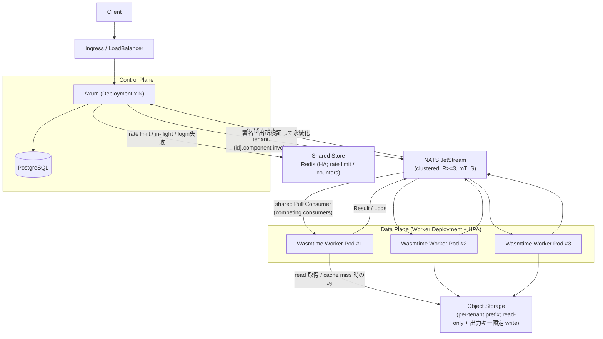

# Kubernetes 上に複数の Wasmtime Worker を並べる構成（物理 / デプロイ構成）

物理デプロイの観点で、Data Plane を Kubernetes 上の複数 Worker Pod として水平スケールする構成を示す。論理的なデータフロー（結果返却経路など）は `アーキテクチャ図.md` を参照。正典は `仕様書.md` 本文とする。

> Worker は HPA で水平スケールし、JetStream の共有 Pull Consumer（competing consumers）により 1 ジョブを 1 Worker のみが処理する（多重実行なし）。Pod は非 root / read-only rootfs / NetworkPolicy / seccomp を併用してサンドボックスを多層化する（`仕様書.md` §7）。
