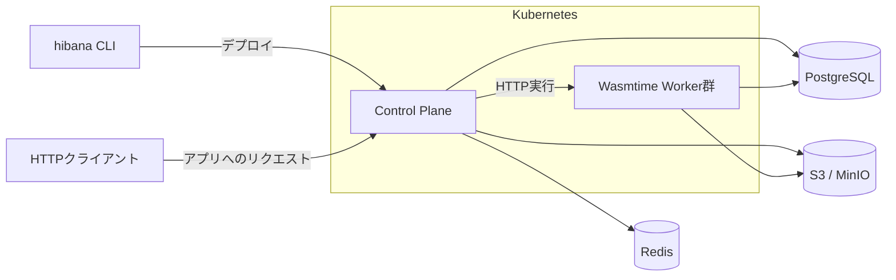

# Hibana

**自分のKubernetesで動かす、Web APIのためのWasmサーバレス基盤。**

Hibanaは、Hono・TypeScript・JavaScript・Rust・Goで書いたWeb APIを、自分たちのインフラにデプロイできるセルフホスト型の実行基盤です。`hibana` CLIでプロジェクトを作り、ローカルで動かし、オンプレミスのKubernetesへ配備できます。

Cloudflare Workersのような短い開発・配備の流れを参考にしています。実行にはWasmtimeを使い、各言語のアプリを共通のWASI HTTP Componentとして扱います。

現在は開発中のMVPです。ローカル開発とKubernetesへの配備を提供しており、本番利用の条件は[運用ガイド](docs/on-prem-production.md)にまとめています。

## できること

- **CLIで開発から配備まで。** `init`で雛形を作成し、`dev`で変更を確認、`deploy`でビルドと配備を実行します。
- **使い慣れた言語でWeb APIを記述。** Hono、JS/TSのFetchハンドラー、Rust・GoのWASI HTTPハンドラーに対応します。
- **ローカルでもWasmtimeで実行。** 配備先と同じ実行モジュールを使い、ソース変更時に再ビルド・再起動します。
- **環境変数とSecretsを管理。** アプリの設定や秘密値をCLIから配備先へ渡せます。
- **バージョンを切り替え。** 新しいコードを配備し、必要に応じて直前の版や指定した版へrollbackできます。
- **実行資源とアクセスを制御。** テナント認証、実行時間・メモリ・同時実行数の制限、外向き通信の許可制御を備えます。

HTTPのバイナリ入出力と、SSEなどのレスポンスストリーミングにも対応しています。

## ローカルで試す

Node.js 24以上、npm、Rust toolchainを用意してください。CLIは現在このリポジトリから利用します。npmパッケージはまだ公開していません。

リポジトリを取得し、そのルートで実行します。

```bash
npm ci --prefix sdk
cargo build --locked --release -p faas-worker
node sdk/src/cli.mjs init my-api --template hono
cd my-api
npm run dev
```

`http://127.0.0.1:8787`でAPIが起動します。別のターミナルから呼び出せます。

```bash
curl http://127.0.0.1:8787
# {"message":"Hello Hibana"}
```

生成される`src/index.ts`は通常のHonoアプリです。専用アダプターのインポートは必要ありません。

```ts
import { Hono } from "hono";

const app = new Hono<{ Bindings: { GREETING: string } }>();
app.get("/", c => c.json({ message: c.env.GREETING }));
app.post("/echo", async c => c.body(await c.req.arrayBuffer()));

export default app;
```

ファイルを編集すると変更が反映されます。ローカル開発にはKubernetes、PostgreSQL、Redis、オブジェクトストレージの起動は不要です。`Ctrl-C`で終了します。

## 対応言語

| テンプレート | アプリの書き方 | ビルドに使うもの |
|---|---|---|
| `hono` | Honoアプリをdefault export | Node.js / npm |
| `javascript` | `export default { fetch(request, env, context) { … } }` | Node.js / npm |
| `rust` | WASI HTTPハンドラー | Rust / `wasm32-wasip2` |
| `go` | WASI HTTPハンドラー | Go / componentize-go |

`--template`で選択します。`javascript`はTypeScriptの雛形を生成し、通常の`.js`ファイルもエントリーポイントに指定できます。Goのビルドツールはテンプレートでバージョンを固定しています。

Hono・JavaScriptのプロジェクトでは`npm run dev`や`npx hibana deploy`を使えます。Rust・Goのプロジェクトにはnpm依存を追加せず、共通CLIから設定ファイルを指定して操作します。たとえば、リポジトリのルートから次のように始められます。

```bash
node sdk/src/cli.mjs init my-rust --template rust
node sdk/src/cli.mjs dev -c my-rust/hibana.json
```

ビルド済みのWASI HTTP Componentも配備できます。言語別のツール要件とビルド設定は[CLIガイド](sdk/README.md)を参照してください。

## Hibanaへデプロイする

基盤管理者から、Hibanaの管理APIのURLとテナントの認証情報を受け取ります。アプリ開発者がKubernetesの資格情報を持つ必要はありません。

先ほどの`my-api`ディレクトリで、接続先とトークンを自分の環境の値に置き換えて実行します。現在の配備操作には**テナント管理者権限**を使います。

```bash
export HIBANA_URL="https://api.hibana.example.com"
export HIBANA_TOKEN="<テナント管理者のトークン>"
npx hibana deploy
```

`deploy`がアプリをビルドし、設定とともにアップロードして新しいバージョンを公開します。ビルドだけを行う場合は`npx hibana build`を使います。

アプリのホスト名は`<アプリ名>.<テナントのスラッグ>.<アプリ用ドメイン>`です。たとえば`my-api.my-team.apps.example.com`のようになります。DNS・TLS・アプリ用ドメインは基盤管理者が設定します。

トークンの代わりに`hibana login`でログインする方法もあります。認証方法とバージョンの指定は[CLIガイド](sdk/README.md)に記載しています。

## 設定・Secrets・rollback

アプリの設定は`hibana.json`にまとめます。

```json
{
  "name": "my-api",
  "main": "src/index.ts",
  "vars": {
    "GREETING": "Hello Hibana"
  },
  "limits": {
    "memory_mb": 256,
    "timeout_ms": 15000
  }
}
```

`vars`はHonoの`c.env`、Fetchハンドラーの`env`、Rust・GoのWASI環境変数から読み取れます。`limits`ではWasmのメモリと実行時間を設定します。

秘密値は`vars`に書かず、Secretsとして登録します。一度デプロイしたアプリに対して、プロジェクトのディレクトリで実行してください。

```bash
npx hibana secret put API_KEY < /path/to/secret.txt
npx hibana deploy
npx hibana secret list
```

新しく登録したSecretは、次の`deploy`でアプリのバージョンに使用権限を付けます。ローカル専用の秘密値は`.dev.vars`にdotenv形式で記述できます。`.dev.vars`と、成果物・認証情報を格納する`.hibana/`はGitに含めません。

コードを以前の状態に戻すときは次のコマンドを使います。

```bash
npx hibana rollback
# 配備済みの版を指定する場合
npx hibana rollback --version 1.0.0
```

rollbackが戻すのはコードのバージョンです。環境変数・Secrets・外部データは巻き戻しません。

## 自分のKubernetesで運用する

Hibanaの基盤はRust製のControl PlaneとWasmtime Workerで構成されます。Control Planeが配備・認証・HTTP受付を担当し、WorkerがリクエストごとにWasmを実行します。



PostgreSQLは配備・実行記録・テナント情報、Redisは共有の受付制限、S3/MinIOはWasm成果物の保管に使います。Worker群がアプリの実行を受け持つため、アプリごとにDockerfileやKubernetesマニフェストを書く必要はありません。

基盤管理者向けに、Kubernetesマニフェストと専用のkind環境を用意しています。[Kubernetes導入ガイド](deploy/kubernetes/README.md)から、基盤の起動とサンプルアプリの配備を試せます。本番環境ではDNS・TLS、永続ストレージ、監視、バックアップなどをサイトに合わせて構成します。

## 利用できる範囲

現在の実行対象は`wasi:http/incoming-handler@0.2.3`を実装するWebAssembly Componentです。JS/TSはCLIがJavaScriptエンジンを含むComponentへ変換し、Rust・Goも同じHTTP契約で動作します。既存アプリを移す場合は、対応するAPIとビルド形式の確認が必要です。

Cloudflare Workers / WranglerやNode.js APIの完全互換は提供しません。WebSocket、WASI Preview 1単体、任意のWIT、KV・DB・Queueなどのアプリ向けBindingも現在の対象外です。

外向き通信は既定で拒否します。配備先では管理者が許可先を承認でき、ローカル`dev`では外向き通信を許可する設定をまだ提供していません。

Wasmの隔離と実行制限に加え、ホスト・ネットワーク・資格情報の保護も必要です。コンパイルの隔離、敵対するテナント間の追加隔離、コードと環境変数の原子的な切替など、本番利用前に残る課題を[セキュリティ境界](docs/security.md)と[本番導入条件](docs/on-prem-production.md)で公開しています。

## ドキュメント

| ガイド | 内容 |
|---|---|
| [CLIガイド](sdk/README.md) | コマンド、言語別セットアップ、`hibana.json`、認証 |
| [Kubernetes導入ガイド](deploy/kubernetes/README.md) | ローカルクラスタ、マニフェスト、配備手順 |
| [アーキテクチャ](docs/architecture.md) | 実行経路、モジュールの責務、依存関係 |
| [セキュリティ境界](docs/security.md) | 保護対象、実行制限、依存監査、残る課題 |
| [本番導入条件](docs/on-prem-production.md) | 可用性、TLS、バックアップ、運用の準備 |
| [検証記録](docs/kubernetes-validation.md) | CLI・Wasmtime・Kubernetesの検証結果と再現手順 |
| [MVPの範囲](docs/mvp.md) | プロジェクトの対象と機能追加の判断基準 |

## ライセンス

[MIT](LICENSE)
