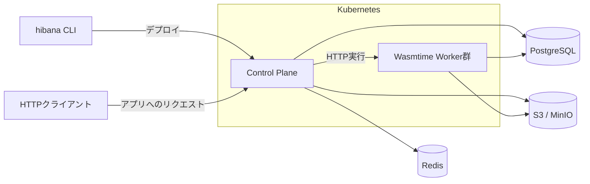

# Hibana

**自分のKubernetesで動かす、Web APIのためのWasmサーバレス基盤。**

Hibanaは、Hono・TypeScript・JavaScript・Rust・Goで書いたWeb APIを、自分たちのインフラにデプロイできるセルフホスト型の実行基盤です。`hibana` CLIでプロジェクトを作り、ローカルで動かし、オンプレミスのKubernetesへ配備できます。

Cloudflare Workersのような短い開発・配備の流れを参考にしています。実行にはWasmtimeを使い、各言語のアプリを共通のWASI HTTP Componentとして扱います。

現在の公開候補版は[`0.2.0-rc.10`](https://github.com/yukiharada1228/hibana/releases/tag/v0.2.0-rc.10)です。npmからCLIを導入でき、GitHub Releasesからランタイム・コンソール・基盤を取得できます。OIDC認証、KeycloakのKubernetes構成生成、アプリの外部通信設定、`tail`とコンソールでのログ閲覧に対応しています。[版ごとの変更と基盤の導入手順](docs/release-candidate.md)を確認し、各コンポーネントのバージョンを揃えてください。

v0.1.0時点の2時間のHTTP負荷と、配備・復元・停止・削除の[自動受入結果](docs/pilot-validation.md)を公開しています。実オンプレでの本番利用の条件は[運用ガイド](docs/on-prem-production.md)にまとめています。

初回の検証には空DBを使います。0.2.0-rc.2から更新する場合は[OIDCへの切り替え](docs/authentication.md#oidc専用版への切り替え)が必要です。v0.1.0の旧DBの扱いは[DB構成・マイグレーション](docs/database.md)を参照してください。

## できること

- **CLIで開発から配備まで。** `init`で雛形を作成し、`dev`で変更を確認、`deploy`でビルドと配備を実行します。
- **使い慣れた言語でWeb APIを記述。** Hono、JS/TSのFetchハンドラー、Rust・GoのWASI HTTPハンドラーに対応します。
- **ローカルでもWasmtimeで実行。** 配備先と同じ実行モジュールを使い、ソース変更時に再ビルド・再起動します。
- **環境変数とSecretsを管理。** アプリの設定や秘密値をCLIから配備先へ渡せます。
- **バージョンを切り替え。** 新しいコードを配備し、必要に応じて直前の版や指定した版へrollbackできます。
- **実行資源とアクセスを制御。** テナント認証、実行時間・メモリ・同時実行数の制限、外向き通信の許可制御を備えます。

HTTPのバイナリ入出力と、SSEなどのレスポンスストリーミングにも対応しています。

## 開発から配備まで

Node.js 24以上とnpmが必要です。グローバルインストールは不要です。管理者から管理APIのURL・テナント名・組織のアカウントを受け取り、ブラウザでログインします。次のURLとテナント名は自分の環境の値に置き換えてください。コンソールがある基盤では通常、同じホストの`/api`が管理APIです。

```bash
npx --yes @yukiharada1228/hibana@0.2.0-rc.10 login \
  --url https://hibana.example.com/api --tenant team
```

ローカルで試すだけならログインは不要です。空のディレクトリにHonoアプリを作り、起動します。

```bash
npx --yes @yukiharada1228/hibana@0.2.0-rc.10 init my-api
cd my-api
npm run dev
```

`init`は実行したCLIと同じバージョンをプロジェクトの`devDependencies`に固定してインストールします。生成したnpm scriptsはプロジェクト内のCLIを使います。`package.json`と`package-lock.json`をGitに保存し、別のPCやCIでは`npm ci`で揃えます。旧版を使っている場合は[既存プロジェクトの更新](sdk/README.md#既存プロジェクトの更新)を先に行ってください。

初回の`dev`で同じバージョンのPC用ランタイムをGitHub Releasesから自動取得します。次回以降は保存済みのランタイムを再利用します。ソースからビルドする手順と閉域環境への搬入は[配布ガイド](docs/releases.md)を参照してください。

`http://127.0.0.1:8787`でAPIが起動します。別のターミナルから呼び出せます。

```bash
curl http://127.0.0.1:8787
# Hello from Hono on Hibana 🔥
```

生成される`src/index.ts`は通常のHonoアプリです。専用アダプターのインポートは必要ありません。

```ts
import { Hono } from 'hono'

const app = new Hono()

app.get('/', (c) => c.text('Hello from Hono on Hibana 🔥'))

export default app
```

ファイルを編集すると変更が反映されます。ローカル開発にはKubernetes、PostgreSQL、Redis、オブジェクトストレージの起動は不要です。`Ctrl-C`で終了します。

アプリからNeonなど外部DBへ接続する場合は、`hibana.json`の`dev.allow_outbound`に`HOST:PORT`を指定し、接続文字列を`.dev.vars`へ保存します。[ローカルDB接続の設定](sdk/README.md#ローカルで外部dbへ接続する)を参照してください。

ログイン済みなら、`my-api`ディレクトリで配備し、そのままログを監視できます。

```bash
npm run deploy
npm exec -- hibana tail
```

別のターミナルから、`deploy`が表示したアプリURLを`curl`で呼び出してください。`tail`は**監視開始後に完了した実行**を表示し、`console.log`・`console.error`の出力も確認できます。過去の実行はコンソールの実行履歴で確認します。`Ctrl+C`で監視を終了します。詳細は[アプリログ](docs/application-logs.md)を参照してください。

コードを変更してもう一度`npm run deploy`した後、直前の配備に戻す場合は次を実行します。切り戻しには以前の配備が必要です。

```bash
npm exec -- hibana rollback
```

## 対応言語

| テンプレート | アプリの書き方 | ビルドに使うもの |
|---|---|---|
| `hono` | Honoアプリをdefault export | Node.js / npm |
| `javascript` | `export default { fetch(request, env, context) { … } }` | Node.js / npm |
| `rust` | WASI HTTPハンドラー | Rust / `wasm32-wasip2` |
| `go` | WASI HTTPハンドラー | Go / componentize-go |

`--template`で選択します。`javascript`はTypeScriptの雛形を生成し、通常の`.js`ファイルもエントリーポイントに指定できます。Goのビルドツールはテンプレートでバージョンを固定しています。

Hono・JavaScriptのプロジェクトでは`npm run dev`や`npm run deploy`を使えます。Rust・Goのプロジェクトにはnpm依存を追加せず、`npx`から設定ファイルを指定して操作します。

```bash
npx --yes @yukiharada1228/hibana@0.2.0-rc.10 init my-rust --template rust
npx --yes @yukiharada1228/hibana@0.2.0-rc.10 dev -c my-rust/hibana.json
```

ビルド済みのWASI HTTP Componentも配備できます。言語別のツール要件とビルド設定は[CLIガイド](sdk/README.md)を参照してください。

## Hibanaへデプロイする

基盤管理者から、Hibanaの管理APIのURLとテナントの認証情報を受け取ります。アプリ開発者がKubernetesの資格情報を持つ必要はありません。

対話ログインは開発環境も含め、組織のOIDC認証基盤を使用します。ログインした接続先はPCに保存され、プロジェクト作成後も使われます。通常の配備には**Read・Deployスコープ**が必要です。CIから配備するときは専用APIトークンを使います。[接続先とCIの設定](docs/remote-cli.md#開発者の操作)、[認証・OIDC](docs/authentication.md)を参照してください。

`deploy`がアプリをビルドし、コード・環境変数・選択したSecretsの参照を一つのバージョンとして公開します。失敗時には稼働中のコードと設定を維持します。ビルドだけを行う場合は`npm run build`を使います。

アプリのホスト名は`<アプリ名>.<テナントのスラッグ>.<アプリ用ドメイン>`です。たとえば`my-api.my-team.apps.example.com`のようになります。DNS・TLS・アプリ用ドメインは基盤管理者が設定します。

## 設定・Secrets・rollback

アプリの設定は`hibana.json`にまとめます。

```json
{
  "name": "my-api",
  "main": "src/index.ts",
  "vars": {},
  "limits": {
    "memory_mb": 256,
    "timeout_ms": 15000
  }
}
```

`vars`はHonoの`c.env`、Fetchハンドラーの`env`、Rust・GoのWASI環境変数から読み取れます。`limits`ではWasmのメモリと実行時間を設定します。

秘密値は`vars`に書かず、Secretsとして登録します。一度デプロイしたアプリに対して、プロジェクトのディレクトリで実行してください。

```bash
# テナント管理者が登録し、このアプリへの利用を許可
npm exec -- hibana secret put API_KEY < /path/to/secret.txt
npm exec -- hibana secret allow-deploy API_KEY
# hibana.jsonに "secrets": ["API_KEY"] を追加してから配備
npm run deploy
npm exec -- hibana secret list
```

`hibana.json`の`secrets`には使用する名前だけを列挙します。管理者が許可したSecretのうち、列挙したものだけを配備先へ渡します。通常の`deploy`・`rollback`はRead・Deployスコープで実行でき、Adminは不要です。`secret deny-deploy API_KEY`は今後の配備への許可を止めます。既存バージョンからも利用を止める場合は`secret delete API_KEY`を使います。ローカル専用の秘密値は`.dev.vars`にdotenv形式で記述できます。`.dev.vars`と、ビルド成果物を格納する`.hibana/`はGitに含めません。

コードを以前の状態に戻すときは次のコマンドを使います。

```bash
npm exec -- hibana rollback
# 配備済みの版を指定する場合
npm exec -- hibana rollback --version 1.0.0
```

rollbackはコード・環境変数・選択したSecretsの参照を一緒に戻します。Secretsの値と外部データは巻き戻しません。旧環境から更新する場合は[デプロイと移行の仕様](docs/deployment.md)を確認してください。

## 自分のKubernetesで運用する

Hibanaの基盤はRust製のControl PlaneとWasmtime Workerで構成されます。Control Planeが配備・認証・HTTP受付を担当し、WorkerがリクエストごとにWasmを実行します。



PostgreSQLは配備・実行記録・テナント情報、Redisは共有の受付制限、S3/MinIOはWasm成果物の保管に使います。Worker群がアプリの実行を受け持つため、アプリごとにDockerfileやKubernetesマニフェストを書く必要はありません。

CLIはnpmまたはGitHubのtarballからPCへ導入でき、`hibana login --profile onprem --url https://hibana.example.internal/api --tenant team`でリモート基盤を選択できます。開発者のアプリ操作にDockerやKubernetes資格情報は不要です。[CLI配布・接続プロファイル・オンプレ構成](docs/remote-cli.md)を参照してください。

イントラネットのブラウザから使う[コンソール](docs/console.md)を`console/`に用意しています。Kubernetesが画面と管理APIを提供し、CLIで配備したアプリの一覧・バージョン・切り戻し・利用量を確認できます。アプリの実行・配信は基盤側で継続します。

基盤管理者は[GitHubの配布ガイド](docs/releases.md)に従ってイメージを社内レジストリへ搬入し、DNS・TLS・依存サービスを設定したoverlayで既存クラスタへ導入します。基盤の操作にはkubectl・Python 3・PyYAMLと、管理者用のKubernetes資格情報が必要です。

```bash
hibana platform install --kubeconfig FILE --context onprem \
  --overlay PATH --image registry.example.internal/hibana/platform@sha256:DIGEST
hibana platform stop --kubeconfig FILE --context onprem
hibana platform start --kubeconfig FILE --context onprem
hibana platform uninstall --kubeconfig FILE --context onprem --yes
```

基盤そのものを手元で開発する場合は、ソースを取得して`hibana platform install --source .`で専用kind環境を作成できます。管理APIは`http://127.0.0.1:18080`、アプリHTTPは`http://127.0.0.1:18084`です。[Kubernetes導入ガイド](deploy/kubernetes/README.md)を参照してください。

## 利用できる範囲

現在の実行対象は`wasi:http/incoming-handler@0.2.3`を実装するWebAssembly Componentです。JS/TSはCLIがJavaScriptエンジンを含むComponentへ変換し、Rust・Goも同じHTTP契約で動作します。既存アプリを移す場合は、対応するAPIとビルド形式の確認が必要です。

Cloudflare Workers / WranglerやNode.js APIの完全互換は提供しません。WebSocket、WASI Preview 1単体、任意のWIT、KV・DB・Queueなどのアプリ向けBindingも現在の対象外です。

追加機能はユーザーが選んだ JS モジュールや Rust 製 Wasm 部品をアプリへ同梱します。拡張パッケージをnpm依存として導入し、`extensions`配列に名前を指定すると、CLIが対応する契約・必要権限を確認してHonoと合成し、一つの `.wasm` として配備できます。ローカル拡張も`"./extensions/foo"`として同じ形式で指定できます。[アプリ拡張の設定と動作例](docs/application-extensions.md)を参照してください。

外向き通信は既定で拒否します。配備先では管理者が許可先を承認し、ローカル`dev`では`hibana.json`の`dev.allow_outbound`に接続先の`HOST:PORT`を指定します。[ローカルDB接続の設定](sdk/README.md#ローカルで外部dbへ接続する)を参照してください。

Wasmの隔離と実行制限に加え、ホスト・ネットワーク・資格情報の保護も必要です。コンパイルの追加隔離、敵対するテナント間の追加隔離、実環境での負荷・障害試験など、本番利用前に残る課題を[セキュリティ境界](docs/security.md)と[本番導入条件](docs/on-prem-production.md)で公開しています。

## ドキュメント

| ガイド | 内容 |
|---|---|
| [CLIガイド](sdk/README.md) | コマンド、言語別セットアップ、`hibana.json`、認証 |
| [MVPの試用受入](docs/pilot.md) | 開発者へ渡すもの、確認項目、継続負荷と復元試験 |
| [Kubernetes導入ガイド](deploy/kubernetes/README.md) | ローカルクラスタ、マニフェスト、配備手順 |
| [アーキテクチャ](docs/architecture.md) | 実行経路、モジュールの責務、依存関係 |
| [スケールと過負荷制御](docs/scaling.md) | Workerの資源予算、HPA、DB接続数、負荷試験 |
| [セキュリティ境界](docs/security.md) | 保護対象、実行制限、依存監査、残る課題 |
| [本番導入条件](docs/on-prem-production.md) | 可用性、TLS、バックアップ、運用の準備 |
| [検証記録](docs/kubernetes-validation.md) | CLI・Wasmtime・Kubernetesの検証結果と再現手順 |
| [MVPの範囲](docs/mvp.md) | プロジェクトの対象と機能追加の判断基準 |

## ライセンス

[MIT](LICENSE)
