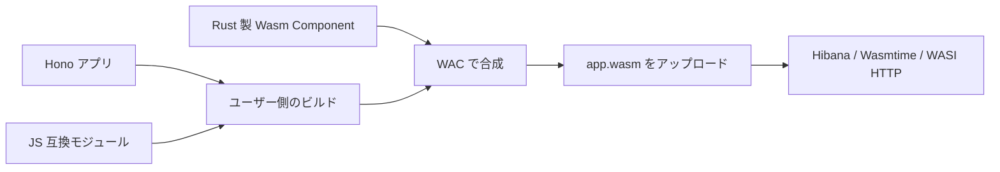

# アプリに同梱する拡張

Hibana の実行契約は `wasi:http/incoming-handler@0.2.3` を export する WebAssembly Component とする。Hono の Fetch handler を Wasm に変換し、認証、配備、HTTP 入出力、環境変数、実行制限、通信許可を提供する。Node.js、Durable Objects、DB、Queue、動画処理などのアプリ向け機能は本体へ組み込まない。

追加機能はユーザーが選んだ JS モジュールまたは Wasm Component としてアプリに同梱する。ビルド結果は一つの `.wasm` で、既存の `hibana deploy` でアップロードする。配備先で npm パッケージをインストールしたり、Rust の動的ライブラリを読み込んだりする必要はない。

この仕組みは現行ソースの候補版向けです。公開済み v0.1.0 には含まれないため、[候補版の導入手順](release-candidate.md)で CLI と基盤を揃えてください。



## 配布された拡張パッケージを使う

拡張の名前と取得元は **`hibana.json` だけ**に書きます。アプリの `package.json` は Hono・LangChain などの通常の JS 依存を管理します。次は依存同梱版の tarball を `vendor/` に置く例です。

```json
{
  "name": "my-api",
  "main": "src/index.ts",
  "extensions": {
    "@hibana/postgres-scram": "./vendor/hibana-postgres-scram-0.7.5-bundle.tgz"
  }
}
```

あとは通常の `hibana build`・`hibana dev`・`hibana deploy` を使います。CLI が拡張を `.hibana/extensions/` に取得し、JS の参照先、事前読込、WIT、ビルド済み Wasm を取り込みます。アプリの `package.json`・`package-lock.json`・`node_modules` は変更しません。Wasm 部品の合成には WAC が必要ですが、配布済み部品の利用に Rust のコンパイルは不要です。

取得元にはプロジェクト内の `./…tgz`、HTTPS の `.tgz` URL、registry に公開済みの完全なバージョン（例：`"1.2.3"`）を指定できます。範囲指定・`latest`・Git URL・認証情報やクエリを含む URL は受け付けません。ローカルファイルは symlink を含めてプロジェクト内に限定します。現在の `@hibana/*` は npm registry へ未公開なので、配布 tarball を使ってください。

完全なバージョンと拡張の `package.json` の `version` は、同じ `semver` 検証を通します。128 文字以内の正規表記を使い、`1.2.3-rc.1+build.01` のようなプレリリース・ビルド情報も保持します。`v` 接頭辞、前後の空白、`01.2.3`・`1.2.3-01` のような先頭ゼロ、`semver` が扱えない巨大な数値は拒否します。

初回の取得・宣言検証後に、確定した依存と整合性情報を **`hibana-lock.json`** へ保存します。`hibana.json`・`hibana-lock.json`・ローカル tarball を Git で管理し、生成物の `.hibana/` は除外します。キャッシュを消しても同じ lock から復元できます。CI では次を使い、lock がない場合や設定と異なる場合にビルドを停止させます。

```sh
npm ci
hibana build --frozen-lockfile
```

更新時は `hibana.json` の版・URL・ファイル名を変更して `hibana build` を実行し、更新された lock もコミットします。同じパスの tarball の内容が変わった場合はエラーになるため、意図した更新には新しいファイル名を使います。`dev` は設定・lock・指定した tarball の変更を監視し、キャッシュ内部は監視しません。

他の拡張を追加・削除した場合も、取得元が変わらない tarball の整合性を確認します。拡張をすべて外した場合は通常の `hibana build` で空の構成を lock に記録し、その変更もコミットしてください。`--frozen-lockfile` は更新前の lock との不一致を拒否します。最初から拡張も lock もないアプリには、lock を作成する必要はありません。

拡張の追加・削除・更新は既存の lock を引き継いで解決し、変更に必要のない依存バージョンは維持します。同時実行で異なる構成の lock が先に保存された場合は、上書きせずエラーにします。設定を確認してビルドを再実行してください。lock 保存中の強制終了で `.hibana/lock-update` が残った場合は待機がタイムアウトします。実行中の Hibana コマンドがないことを確認してから、このディレクトリを削除して再実行してください。

キャッシュ内のファイルの欠損・サイズ不一致や完了記録の破損は、次回ビルドで検出し、lock に従って自動復元します。復元時はアプリの npm 依存や lock を変更せず、取得が完了したファイルから置き換えます。

CLI 内部の取得処理は npm を使いますが、install スクリプトや拡張のホスト向けエントリーポイントは実行しません。拡張の内部依存は配布者が管理します。[PostgreSQL の同梱版](../extensions/README.md#利用者向けの配布と移行)なら tarball 一つで完結し、下位の部品を利用者が列挙する必要はありません。

## 拡張パッケージを作る

パッケージ直下に`hibana.extension.json`を置きます。例えばBufferのJS実装だけを提供する拡張の宣言は次の形です。

```json
{
  "schemaVersion": 1,
  "runtime": "wasi:http/incoming-handler@0.2.3",
  "aliases": { "node:buffer": "./compat/buffer.mjs" },
  "preload": ["./compat/globals.mjs"],
  "permissions": []
}
```

`compat/buffer.mjs`で`export { Buffer } from 'buffer/';`を提供し、npmの`buffer`を拡張パッケージの依存へ追加します。グローバルが必要なら `compat/globals.mjs` で `import { Buffer } from "buffer/"; globalThis.Buffer ??= Buffer;` を実行します。

`package.json`の`exports`を使う場合は、`"./hibana.extension.json": "./hibana.extension.json"`を公開します。配布する`files`には宣言、JS部品、WIT、完成済みWasmを含めてください。Rustのビルドは配布者が`npm pack`より前、または`prepack`で行います。

| 宣言 | 内容 |
|---|---|
| `schemaVersion` | 必須。CLIが読む拡張形式の版。`1`と`2`に対応。依存拡張の宣言には`2`を使用 |
| `dependencies` | schemaVersion 2 で使用。先に組み込む拡張の npm パッケージ名。`package.json` の dependencies または peerDependencies にも宣言する |
| `runtime` | 必須。対象のHTTP契約。現在は`wasi:http/incoming-handler@0.2.3`との完全一致 |
| `aliases` | import名からJSファイルへの対応 |
| `preload` | アプリより前に読むJSファイル。依存拡張を先に読み、同じ依存は一度だけ実行 |
| `components` | 配布済みWasm Componentのファイル |
| `imports` / `wit` | JSから利用するWIT interface名と、その定義を含むディレクトリ。Wasm部品と合わせて指定 |
| `permissions` | 任意の必要権限宣言。現在は`[]`または`["outbound-network"]` |

パッケージ内のパスは宣言ファイルを基準とする`./`始まりで指定します。親ディレクトリへの参照やパッケージ外を指すファイルのシンボリックリンクは拒否します。WITディレクトリには部品のinterface定義を置きます。CLIは標準WASIの依存と各パッケージの定義を作業ディレクトリへ集め、HTTP worldを生成します。利用者が独自の world を指定する設定はありません。

JS用の宣言を含むパッケージは`main`を持つアプリ向けです。ビルド済みComponentのアプリにも、`components`だけを提供するパッケージを同梱できます。同じaliasやinterfaceを複数の拡張が提供すると、暗黙に上書きせずエラーになります。

`schemaVersion`と`runtime`の検査は宣言の互換性確認です。WACが部品間の型を検証し、配備先が最終Wasmとホストimportを検証します。パッケージ内のコードが特定のNodeライブラリと互換かどうかは、配布者が対応範囲を示し、実アプリで確認してください。

**必要権限の宣言は許可を与えません。** `outbound-network`を要求する拡張は、ビルド時に管理者による許可が必要なことを表示します。ローカルの`dev`では`hibana.json`の`dev.allow_outbound`に接続先の`HOST:PORT`を指定します。未指定なら起動前に拒否します。配備先では管理者によるアプリの通信許可が別途必要で、ローカルの許可設定はアップロードされません。宣言に書かれていなくても、実際の通信・ファイル操作にはホストの制限が適用されます。[ローカルDB接続の設定](../sdk/README.md#ローカルで外部dbへ接続する)を参照してください。

## 拡張が別の拡張に依存するとき

アプリは使いたい拡張の名前と取得元だけを指定します。`@hibana/node-tls` を選ぶと、必要な Node TCP アダプター・Buffer・TLS エンジンを依存として解決します。拡張作者が書く `@hibana/node-tls` の宣言は次のとおりです。

```json
{
  "schemaVersion": 2,
  "runtime": "wasi:http/incoming-handler@0.2.3",
  "dependencies": ["@hibana/node-net", "@hibana/node-buffer", "@hibana/tls"],
  "aliases": { "tls": "./src/index.mjs", "node:tls": "./src/index.mjs" }
}
```

拡張作者は同じパッケージの `package.json` で各依存のバージョンを指定します。[現在の依存バージョン](../extensions/node-tls/package.json)を参照してください。これは配布物の内部情報であり、利用アプリへ転記しません。CLI は `.hibana/` 内の依存を、その宣言元を基準に解決します。未公開の依存は配布者が tarball に同梱するか、利用者が取得元を `hibana.json` に指定する必要があります。JS アダプターと Wasm エンジンを別パッケージにし、エンジンのみを利用できる構成です。

依存を先に、参照元を後に合成します。直接指定と間接指定で同じ実体を参照する場合も、一度だけ取り込みます。循環依存、同名拡張の異なるインストール、alias／interface の競合、依存を含む 64 個超の拡張はビルド前に拒否します。複数のインストールが競合した場合は npm の依存バージョンを揃えて重複を解消してください。依存の権限宣言も集約し、外向き通信を要する依存があれば `dev.allow_outbound`での接続先指定を求めます。

旧 CLI は schemaVersion 2 を拒否するので、利用前に CLI を更新してください。既存の schemaVersion 1 のパッケージは変更せず利用できます。

## 手元で作る拡張も同じ形式にする

npm パッケージとして配布する前は、同じ宣言をプロジェクト内のディレクトリに置きます。例えば `extensions/buffer/hibana.extension.json` に上の Buffer 用の宣言と `compat/` を置き、次のように登録します。

```json
{
  "name": "my-api",
  "main": "src/index.ts",
  "extensions": ["./extensions/buffer"]
}
```

この配列形式はローカル開発と旧構成との互換用です。既存の `node_modules` に導入済みのパッケージ名も指定できますが、自動取得と `hibana-lock.json` による固定は行いません。配布物を使うアプリでは前述の名前と取得元を対応させる形式を使います。両形式の混在はできません。

ローカル拡張も配布拡張も、パス・形式・権限・競合について同じ検査を通ります。配列の `./` は `hibana.json` からの相対ディレクトリで、宣言中のパスは `hibana.extension.json` からの相対パスです。

`dev` はローカル拡張のソース、宣言、`dist/` 内の配布済み部品の変更を監視します。`target/` 等の中間生成物や `node_modules/` 内は監視しません。Rust ソースから配布用 Wasm を作る工程は作者の `npm run build` 等で実行してください。Hibana が拡張のビルドフックを自動実行することはありません。

JS だけの拡張に WAC は不要です。Wasm 部品の合成には、ビルド環境に WAC を用意します。ソースから導入する場合は Rust toolchain で以下を実行できます。利用者が拡張自体を Rust で再コンパイルする必要はありません。

```sh
cargo install wac-cli --version 0.11.0 --locked --no-default-features --features wit
```

## 旧候補版の設定から移行する

旧名 `hibana.lock` を作成済みの場合は、内容を変えずに `hibana-lock.json` へ変更します。CLI も更新してください。

```sh
mv hibana.lock hibana-lock.json
```

アプリの拡張依存を `package.json` で管理していた場合は、次の手順で移します。

1. `hibana.json` の `extensions` を名前と取得元の対応表に変更します。npm の `file:vendor/x.tgz` は `./vendor/x.tgz` に直します。
2. アプリの `package.json` から移した拡張を削除し、`npm install --ignore-scripts` でアプリ側の lock と `node_modules` を更新します。Hono などの通常の依存は維持します。
3. `hibana build` を実行し、生成された `hibana-lock.json` を保存します。以後、拡張の導入にアプリ側の `npm install` は不要です。

さらに古い候補版からの移行では、次も適用します。

- `"extensions": { "packages": ["@org/example"] }` は、各パッケージの取得元を持つ対応表に変更します。
- アプリに直接書いていた `aliases`、`preload`、`components` は、ローカル拡張の `hibana.extension.json` に移します。パスはその宣言からの相対パスへ直します。
- `imports` と `wit` も宣言へ移し、`schemaVersion: 1` と `runtime` を追加します。HTTP world は CLI が生成するため `world` は削除します。
- `extensions.packages` やアプリに直接書く aliases/WIT は受け付けません。配列形式は既存のローカル開発用に維持します。

CLI 操作は引き続き `hibana build / dev / deploy` です。拡張専用のインストールコマンドは不要です。

## 配備した版の構成を確認する

コンソールのアプリ詳細にある「拡張」から確認できます。CLI は合成後の Wasm の外側に `hibana:build` カスタムセクションを追加します。既存の成果物ハッシュ・署名はこの情報も含む全バイトを対象とするため、別ファイルをアップロードする必要はありません。

記録するのは、入力の種類（JavaScript / ビルド済み Component）、直接指定した拡張、解決した拡張の名前・インストール済みバージョン・依存関係・要求権限です。npm の通常の依存すべてや、実行時に使った関数を列挙するものではありません。取得元 URL、開発 PC の絶対パス、環境変数、Secret は記録しません。ローカル拡張は `hibana.json` の相対参照を使い、版がなければ `null` を記録します。

形式は `schema_version: 1`、`input: "javascript" | "component"`、`roots: string[]`、`extensions: { name, version, dependencies, permissions }[]` です。最大64拡張・JSON 32 KiBとし、管理 API はグラフの参照、循環、重複、未対応の権限を検証して、版と同じトランザクションで保存します。入れ子の Component のカスタムセクションは、そのアプリ全体の構成として扱いません。既に構成情報を持つ Component を拡張の追加なしで配備する場合は、その情報を保持します。Component に新しい拡張を合成する場合は、新たに解決した構成を記録し、元の Wasm 内部を列挙したとは表示しません。

これはビルド元が申告した構成であり、コードの安全性の証明や権限の付与ではありません。通信許可は従来どおり基盤のポリシーが決定します。構成情報がない古い成果物も引き続き配備でき、画面では「未記録」と表示します。詳細は [コンソール](console.md)を参照してください。

## 権限と互換範囲

| 機能 | 拡張側の実装 | Hibana が提供する境界 |
|---|---|---|
| Buffer、events など | npm の JS モジュールを同梱 | アプリの Wasm メモリ・実行時間制限 |
| crypto の計算 | JS または Rust 製 Wasm 部品 | WASI 乱数とアプリの計算資源 |
| net / tls | Node API の橋渡しと WASI ソケット／TLS を使う Wasm 部品 | 許可された送信先への TCP 接続。dev は `dev.allow_outbound`、配備先は管理者の許可が必要 |
| fs | 仮想 FS または外部サービスへのアダプター | 現行ランタイムはホストのディレクトリを公開しない |
| Durable Objects、DB、Queue | アプリまたは別途運用するサービス | 許可された通信経路と環境変数・Secrets |

アップロードした部品はホスト権限を増やさない。アプリと同じ Store、燃料、メモリ総量、実行時間の制限を受ける。最終成果物に残った未対応 interface は配備時の検証／事前リンクで拒否される。自作 interface を Hibana のホスト ABI として登録する機能は設けない。

Node.js バイナリやネイティブ npm addon をアップロードするだけでは動かない。必要な API の振る舞いを JS／Wasm で実装し、既存 WASI の権限内で完結させる。永続化やアラームは、計算用部品の同梱だけでは実現できない。

`net`・`tls` の外向きクライアントは、別々の任意パッケージ [@hibana/node-net](../extensions/node-net/README.md)・[@hibana/node-tls](../extensions/node-tls/README.md) として提供します。TCP だけなら TLS の Wasm は入りません。JS の Duplex と Rust/rustls の Wasm をアプリへ同梱し、標準 WASI sockets のみをホストに要求します。TCP、検証付き TLS、STARTTLS を対象とする限定実装であり、TCP サーバー、`setNoDelay`、Node.js 全体の互換性は提供しません。DB ドライバーなどは必要な API の移植・検証が別途必要です。ホストのファイル操作・子プロセス起動を前提とする依存も、そのままでは動きません。

汎用の回帰試験では、一時パッケージに npm の Buffer と Rust 製 SHA-256 部品を組み合わせます。常設のサンプルアプリは不要です。汎用の暗号と NFKC 正規化も[アルゴリズムごとのパッケージ](../extensions/README.md)と [unicode-nfkc](../extensions/unicode-nfkc/README.md) で提供し、通信・Node API を必要としません。

回帰検証は `scripts/test-application-extensions.mjs`。実際の Hono HTTP 応答を Node の SHA-256／Base64 と照合し、合成後の配備検証、部品の未同梱による拒否、合成失敗時の既存成果物の保持を確認する。

TCP/TLS 拡張は `scripts/test-tcp-tls-extension.mjs` で、配布 tarball からの合成、汎用 Wasmtime 上での実通信と証明書エラー、Hibana 実行環境での権限拒否を確認する。本体の Cargo workspace・CLI の標準依存・Worker イメージに互換実装を追加しない。

単機能の非同梱検証は `scripts/test-extension-boundaries.mjs`。基礎部品を1つだけ有効にしたアプリと、Wasm の実際の import／export を検査します。

Node TCP／TLS 0.6.0からは `@hibana/node-stream/duplex` にだけ依存し、通常の Stream の入口を読み込みません。これにより、Socket だけのアプリから `Transform`・`PassThrough`・`pipeline`・`compose`・追加の演算子を除外します。アプリが `node:stream` を import した場合は従来の API が使え、両方の入口は同じ Duplex コンストラクターを共有します。npm パッケージや CLI 設定は増やしていません。配布 tarball を使ったバンドルの依存一覧と、Stream 同士の相互運用も上記の非同梱検証で確認します。

Node Stream 0.6.0では Readable・Writable・Duplex・Transform・PassThrough・pipeline・compose・finished の8つの[機能別入口](../extensions/node-stream/README.md)を提供します。例えば `@hibana/node-stream/passthrough` には必須の Transform と共通の読み書き処理だけが入り、pipeline・compose・追加の演算子は入りません。finished は完了監視だけを提供し、ストリームのクラス実装を読み込みません。各入口は上流の実装を共有し、通常の `node:stream` と併用できます。

0.6.1では、複数の機能別入口を共通ファイルから再 export した場合も、未使用の入口を除去できるよう `sideEffects` を指定しています。バイト列変換と通常の入口の初期化は保持します。検証では解析したモジュール一覧だけでなく、出力コードに残るモジュールも調べます。

0.7.0では Readable／Writable の Duplex 型判定に必要だった循環参照を切り離し、Readable だけのアプリに Writable・Duplex、Writable だけのアプリに Readable・Duplex が入らないようにしています。配布者が固定した上流の型参照を移植し、生成済みの共有実装を配布します。通常の入口も同じ実装を使い、クラスの同一性・継承・読み書き別の設定を維持します。CLI と Hibana 本体への機能追加はありません。

## DB 接続について

`@hibana/node-net`・`@hibana/node-tls` は通信層です。PostgreSQL のクエリは [postgres-core](../extensions/postgres-core/README.md) が提供し、通信・認証・Pool は必要な部品を選びます。アプリの `src/db.ts` で部品を組み合わせ、`hibana.json` の `extensions` に必要なパッケージを直接指定します。アプリからは `./db` の `Client` を読み込みます。Client だけを使う構成では Pool を追加しません。

pg 8.23.0 と Drizzle 0.45.2 について、汎用 Wasmtime 上で PostgreSQL への TCP／TLS 接続、クエリ、ORM の CRUD・トランザクションを確認しました。Drizzle には Pool 部品も必要です。検証クラスタから Neon への読み取り専用接続も別途確認しています。[検証結果と再現手順](postgres-compatibility.md)を参照してください。

既存のプリセットとして、Pool と全認証をまとめた `@hibana/postgres` と、TLS・証明書用ハッシュを含まない `@hibana/postgres-tcp` も用意しています。プリセットを使う場合は、そのパッケージ名を `extensions` に指定し、`pg` から読み込みます。接続設定で機能を使わなくても、プリセットの依存 Wasm は構成から外れません。

外部 DB の通信先は、初回配備後に管理者が `hibana egress allow db.example.com:5432` またはコンソールのアプリ →「設定」→「許可された外部通信先」で登録します。以降の配備もこの許可を引き継ぎます。接続 URL は Secret に保存し、通信許可にはホスト名とポートだけを指定します。[通信先の管理](console.md#外部通信先の管理)を参照してください。

Hibana の管理用 PostgreSQL は Wasm ランタイムが配備情報や実行記録を管理するための DB であり、ゲスト用 Binding ではありません。接続情報はアプリに公開しません。現在の egress ポリシーは private / loopback 宛ても拒否するので、Docker 内や同じ Kubernetes 内の DB に自動的に接続できるという意味ではありません。

## PostgreSQL の機能を個別に選ぶ

PostgreSQL 0.6.0 では、`postgres-core` に通信・認証の部品を引数で渡せます。`postgres-auth-md5` と `postgres-auth-scram` は独立し、channel binding の証明書ハッシュも使用する関数だけを登録します。[部品を直接選択する例](../extensions/postgres-core/README.md)を参照してください。

0.7.0では接続プールも `postgres-pool` に分離しました。`postgres-core` は Client を提供し、`createPostgres({ transport, authentication, pool: createPool })` と指定した構成だけに Pool を追加します。Client 専用の構成には `pg-pool` のコードやその補助処理は入りません。既存の `postgres`・`postgres-tcp` プリセットは Pool を選択済みです。Drizzle 0.45.2 の node-postgres アダプターは内部で `pg.Pool` を参照するため、独自構成で Drizzle を使う場合も Pool を選択します。

既存ライブラリが `pg` の import を要求する場合、SCRAM 認証と SHA-256 証明書には [@hibana/postgres-scram](../extensions/postgres-scram/README.md) を選べます。`hibana.json` の `extensions` にこのパッケージ名を指定すると、Client・Pool・TCP／TLS を含む `pg` alias を提供します。MD5・追加の証明書ハッシュ・アプリ側の接続用 JS は不要です。プリセットにない組み合わせが必要な場合だけ、ローカル拡張で `pg` alias を用意します。

CLI の専用オプションや新しいマニフェスト形式、グローバルな機能登録は不要です。未選択の認証は `ERR_PG_AUTH_UNAVAILABLE`、不足する証明書ハッシュは `ERR_PG_CERTIFICATE_DIGEST_UNAVAILABLE` で拒否します。各プリセットも同じ公開部品で構成します。
