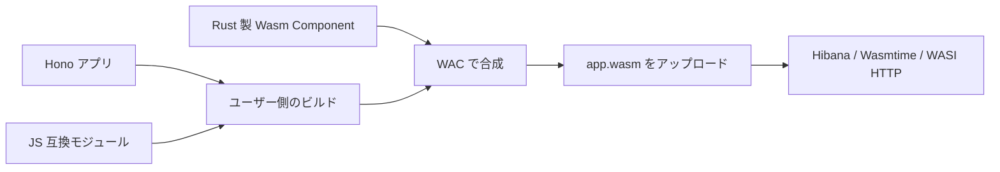

# アプリに同梱する拡張

Hibana の実行契約は `wasi:http/incoming-handler@0.2.3` を export する WebAssembly Component とする。Hono の Fetch handler を Wasm に変換し、認証、配備、HTTP 入出力、環境変数、実行制限、通信許可を提供する。Node.js、Durable Objects、DB、Queue、動画処理などのアプリ向け機能は本体へ組み込まない。

追加機能はユーザーが選んだ JS モジュールまたは Wasm Component としてアプリに同梱する。ビルド結果は一つの `.wasm` で、既存の `hibana deploy` でアップロードする。配備先で npm パッケージをインストールしたり、Rust の動的ライブラリを読み込んだりする必要はない。

この仕組みは現行ソースの候補版向けです。公開済み v0.1.0 には含まれないため、[候補版の導入手順](release-candidate.md)で CLI と基盤を揃えてください。



## 配布された拡張パッケージを使う

拡張をアプリのnpm依存として導入し、`hibana.json`にパッケージ名を追加します。次の名前は説明用です。実際には拡張の配布者が案内するパッケージ名やtarballを使ってください。

```sh
npm install --save-exact @your-org/hono-compat
```

```json
{
  "name": "my-api",
  "main": "src/index.ts",
  "extensions": ["@your-org/hono-compat"]
}
```

あとは通常の`npx hibana build`・`npx hibana dev`・`npx hibana deploy`を使います。CLIがパッケージの宣言からJSの参照先、事前読込、WIT、ビルド済みWasmを取り込みます。Wasm部品を合成する場合は利用者のビルド環境にWACが必要ですが、配布済み部品の利用にRustのコンパイルは不要です。

パッケージの版は`package.json`とlockfileで管理します。CLIは指定されたインストール済みパッケージだけを読み、パッケージのエントリーポイントや独自のインストールフックを実行しません。通常のnpmのインストール処理は利用者の開発環境で行います。`dev`はプロジェクトのパッケージ設定・lockfileの変更で再ビルドし、`node_modules`内やリンク先のソース変更そのものは監視しません。

配布方法まで試せる例は[Hono + 拡張パッケージ](../sdk/examples/hono-extensions/README.md)です。BufferとRust製SHA-256を、Hibana本体から独立した一つの任意パッケージにしています。

## 拡張パッケージを作る

パッケージ直下に`hibana.extension.json`を置きます。例えばBufferのJS実装だけを提供する拡張の宣言は次の形です。

```json
{
  "schemaVersion": 1,
  "runtime": "wasi:http/incoming-handler@0.2.3",
  "aliases": { "node:buffer": "./compat/buffer.mjs" },
  "preload": ["./compat/globals.mjs"],
  "permissions": []
}
```

`compat/buffer.mjs`で`export { Buffer } from 'buffer/';`を提供し、npmの`buffer`を拡張パッケージの依存へ追加します。グローバルが必要なら `compat/globals.mjs` で `import { Buffer } from "buffer/"; globalThis.Buffer ??= Buffer;` を実行します。

`package.json`の`exports`を使う場合は、`"./hibana.extension.json": "./hibana.extension.json"`を公開します。配布する`files`には宣言、JS部品、WIT、完成済みWasmを含めてください。Rustのビルドは配布者が`npm pack`より前、または`prepack`で行います。

| 宣言 | 内容 |
|---|---|
| `schemaVersion` | 必須。CLIが読む拡張形式の版。現在は`1` |
| `runtime` | 必須。対象のHTTP契約。現在は`wasi:http/incoming-handler@0.2.3`との完全一致 |
| `aliases` | import名からJSファイルへの対応 |
| `preload` | アプリより前に読むJSファイル。extensions の指定順 |
| `components` | 配布済みWasm Componentのファイル |
| `imports` / `wit` | JSから利用するWIT interface名と、その定義を含むディレクトリ。Wasm部品と合わせて指定 |
| `permissions` | 任意の必要権限宣言。現在は`[]`または`["outbound-network"]` |

パッケージ内のパスは宣言ファイルを基準とする`./`始まりで指定します。親ディレクトリへの参照やパッケージ外を指すファイルのシンボリックリンクは拒否します。WITディレクトリには部品のinterface定義を置きます。CLIは標準WASIの依存と各パッケージの定義を作業ディレクトリへ集め、HTTP worldを生成します。利用者が独自の world を指定する設定はありません。

JS用の宣言を含むパッケージは`main`を持つアプリ向けです。ビルド済みComponentのアプリにも、`components`だけを提供するパッケージを同梱できます。同じaliasやinterfaceを複数の拡張が提供すると、暗黙に上書きせずエラーになります。

`schemaVersion`と`runtime`の検査は宣言の互換性確認です。WACが部品間の型を検証し、配備先が最終Wasmとホストimportを検証します。パッケージ内のコードが特定のNodeライブラリと互換かどうかは、配布者が対応範囲を示し、実アプリで確認してください。

**必要権限の宣言は許可を与えません。** `outbound-network`を要求する拡張は、ビルド時に管理者による許可が必要なことを表示し、現在の`dev`では起動前に拒否します。配備先ではバージョンごとの通信許可が別途必要です。宣言に書かれていなくても、実際の通信・ファイル操作にはホストの制限が適用されます。

## 手元で作る拡張も同じ形式にする

npm パッケージとして配布する前は、同じ宣言をプロジェクト内のディレクトリに置きます。例えば `extensions/buffer/hibana.extension.json` に上の Buffer 用の宣言と `compat/` を置き、次のように登録します。

```json
{
  "name": "my-api",
  "main": "src/index.ts",
  "extensions": ["./extensions/buffer"]
}
```

ローカル拡張も npm 拡張も、パス・形式・権限・競合について同じ検査を通ります。`./` は `hibana.json` からの相対ディレクトリで、宣言中のパスは `hibana.extension.json` からの相対パスです。npm パッケージ名には版を含めず、版と取得元は package.json / lockfile だけで管理します。

`dev` はローカル拡張のソース、宣言、`dist/` 内の配布済み部品の変更を監視します。`target/` 等の中間生成物や `node_modules/` 内は監視しません。Rust ソースから配布用 Wasm を作る工程は作者の `npm run build` 等で実行してください。Hibana が拡張のビルドフックを自動実行することはありません。

JS だけの拡張に WAC は不要です。Wasm 部品の合成には、ビルド環境に WAC を用意します。ソースから導入する場合は Rust toolchain で以下を実行できます。利用者が拡張自体を Rust で再コンパイルする必要はありません。

```sh
cargo install wac-cli --version 0.11.0 --locked --no-default-features --features wit
```

## 旧候補版の設定から移行する

アプリの `extensions` は配列だけに統一しています。

- `"extensions": { "packages": ["@org/example"] }` は `"extensions": ["@org/example"]` に変更します。
- アプリに直接書いていた `aliases`、`preload`、`components` は、ローカル拡張の `hibana.extension.json` に移します。パスはその宣言からの相対パスへ直します。
- `imports` と `wit` も宣言へ移し、`schemaVersion: 1` と `runtime` を追加します。HTTP world は CLI が生成するため `world` は削除します。
- 旧設定は移行案内付きのエラーになります。複数形式を並行して解釈する互換処理はありません。

CLI 操作は引き続き `hibana build / dev / deploy` です。拡張専用のインストールコマンドは増やさず、取得・更新・版固定は npm に任せます。

## 権限と互換範囲

| 機能 | 拡張側の実装 | Hibana が提供する境界 |
|---|---|---|
| Buffer、events など | npm の JS モジュールを同梱 | アプリの Wasm メモリ・実行時間制限 |
| crypto の計算 | JS または Rust 製 Wasm 部品 | WASI 乱数とアプリの計算資源 |
| net / tls | Node API の橋渡しと WASI ソケット／TLS を使う Wasm 部品 | 許可された送信先への TCP 接続。現行 dev は外向き通信を拒否 |
| fs | 仮想 FS または外部サービスへのアダプター | 現行ランタイムはホストのディレクトリを公開しない |
| Durable Objects、DB、Queue | アプリまたは別途運用するサービス | 許可された通信経路と環境変数・Secrets |

アップロードした部品はホスト権限を増やさない。アプリと同じ Store、燃料、メモリ総量、実行時間の制限を受ける。最終成果物に残った未対応 interface は配備時の検証／事前リンクで拒否される。自作 interface を Hibana のホスト ABI として登録する機能は設けない。

Node.js バイナリやネイティブ npm addon をアップロードするだけでは動かない。必要な API の振る舞いを JS／Wasm で実装し、既存 WASI の権限内で完結させる。永続化やアラームは、計算用部品の同梱だけでは実現できない。

`net`・`tls` の外向きクライアントは、任意パッケージ [@hibana/node-net](../extensions/node-net/README.md) として提供します。JS の Duplex と Rust/rustls の Wasm をアプリへ同梱し、標準 WASI sockets のみをホストに要求します。TCP、検証付き TLS、STARTTLS を対象とする限定実装であり、TCP サーバー、`setNoDelay`、Node.js 全体の互換性は提供しません。DB ドライバーなどは必要な API の移植・検証が別途必要です。ホストのファイル操作・子プロセス起動を前提とする依存も、そのままでは動きません。

実装例は [Hono + ユーザー拡張](../sdk/examples/hono-extensions/README.md)。`Buffer` は npm パッケージ、`createHash('sha256')` の計算は Rust 部品が担当する。例の crypto shim は SHA-256 の限定実装であり、Node.js crypto 全体の互換実装ではない。

回帰検証は `scripts/test-application-extensions.mjs`。実際の Hono HTTP 応答を Node の SHA-256／Base64 と照合し、合成後の配備検証、部品の未同梱による拒否、合成失敗時の既存成果物の保持を確認する。

TCP/TLS 拡張は `scripts/test-node-net-extension.mjs` で、配布 tarball からの合成、汎用 Wasmtime 上での実通信と証明書エラー、Hibana 実行環境での権限拒否を確認する。本体の Cargo workspace・CLI の標準依存・Worker イメージに互換実装を追加しない。

## DB 接続について

`@hibana/node-net` は通信層です。PostgreSQL のクエリ・認証・リクエスト内 Pool は、別の任意拡張 [@hibana/postgres](../extensions/postgres/README.md) で提供します。`extensions: ["@hibana/node-net", "@hibana/postgres"]` を設定すると、`pg` の import を Rust/Wasm の暗号処理を組み込んだ適応版に解決します。pg 8.23.0 と Drizzle 0.45.2 について、汎用 Wasmtime 上で PostgreSQL への TCP／TLS 接続、クエリ、ORM の CRUD・トランザクションを確認しました。本番 Hibana の DB 接続試験とは区別しています。[検証結果と再現手順](postgres-compatibility.md)を参照してください。

Hibana の管理用 PostgreSQL は Wasm ランタイムが配備情報や実行記録を管理するための DB であり、ゲスト用 Binding ではありません。接続情報はアプリに公開しません。現在の egress ポリシーは private / loopback 宛ても拒否するので、Docker 内や同じ Kubernetes 内の DB に自動的に接続できるという意味ではありません。
