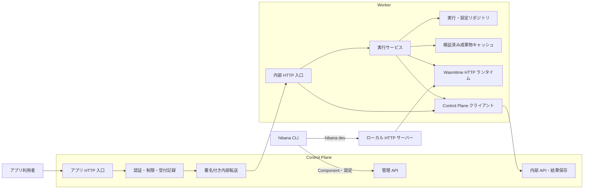

# Hibana のコード構成

Hibana の実行契約は `wasi:http/incoming-handler@0.2.3` です。言語別のビルドは CLI、HTTP の受付・認証・配備管理は Control Plane、Wasm の実行は Worker が担当します。

Node API などの追加機能はユーザーがアプリへ同梱する JS／Wasm 部品として扱い、本体のホスト ABI を増やしません。CLI が必要な部品を合成し、既存の配備経路へ一つの Component を渡します。責任範囲は[アプリ拡張](application-extensions.md)を参照してください。

拡張パッケージはアプリの依存として明示的に導入し、`extensions`配列に列挙します。ローカル拡張も同じ宣言形式で扱います。CLIが宣言形式の版・HTTP契約・必要権限・部品の競合を確認し、WITとWasmの合成をビルド時に行います。拡張の追加によってホスト権限は増えません。認証・資源制限・通信許可は基盤の責任とし、Node互換などのライブラリは任意のアプリ依存として配布します。

CLIは独立したnpmパッケージです。HTTPS管理APIへのアプリ操作、PC用ランタイムでの`dev`、明示的なKubernetes資格情報を使う管理者の基盤操作を分離しています。`dev`は未導入のPC用ランタイムを自動取得します。CLIから基盤ソースやローカルDockerを暗黙に参照しません。[配布とリモート接続の構成](remote-cli.md)を参照してください。

開発者のPCと実行先のKubernetesサーバーは別端末を前提とします。`console/`のReact画面はKubernetes上の独立したNginx Deploymentから静的ファイルを配信し、PCのブラウザとCLIが同じ管理APIを操作します。配備済みアプリの実行・配信はPCの稼働に依存しません。[コンソールの導入・認証・検証](console.md)を参照してください。

## Kubernetesを前提とする本番構成

本番はKubernetes上のControl Planeと常駐Workerで運用します。Deployment・Service/DNS・readiness・終了猶予・必要に応じたHPAで、Workerの配置と増減を管理します。アプリはComponentとして配備し、既存Worker内のWasmインスタンスで実行します。アプリやリクエストの数に対応するPod・Jobは作成しません。

Podの更新・追加と、呼び出しごとのWasmインスタンス生成は別の処理です。Workerはコンパイル済みコードを再利用し、各呼び出しのStore・環境・実行制限を分離します。低遅延の実行に使うWorkerは常駐させ、追加Workerでは成果物の準備を終えてから実行を受け付けます。具体的な上限と動作は[スケール方針](scaling.md)を参照してください。

`runtime/`はローカル開発と本番で共有するため、Kubernetes APIから独立したまま維持します。本番向けの別の配置方式や独自クラスタ管理は実装しません。PostgreSQL・Redis・S3互換ストレージの接続先は導入先で設定でき、クラスタ外のサービスも利用できます。

## プロセスと実行経路

管理 API・アプリ入口・内部 API は同じ Control Plane バイナリの別 listener です。Kubernetes では既存の Service / NetworkPolicy で到達範囲を分けます。この図はコードの責務を示すもので、各箱を別サービスとして配備するものではありません。

PostgreSQL は配備・実行記録・テナント情報の正本、Redis は共有の受付制限と一回限りのトークン管理、S3/MinIO は Wasm の保管に使います。Worker は非特権 DB ロールで実行の取得と設定の参照を行います。Secrets の復号鍵は Control Plane だけが持ちます。

DBの構成、テーブル一覧、空DBからの作成と既存DBの切替方針は[基盤DB](database.md)を参照してください。

## モジュールの責務

| 場所 | 責務 |
|---|---|
| `sdk/src/` | 設定読み込み、言語別ビルド、ローカル起動、管理 API への配備。Hono 専用のサーバー契約を追加しない |
| `shared/src/http.rs` | CP・dev・runtime 共通の型付き HTTP リクエスト、バイナリ符号化、本文サイズの契約 |
| `shared/src/capabilities.rs` | CP・Worker 共通の環境変数と外向き通信の許可設定。旧形式・欠損・不正値の扱いを一か所で定義 |
| `shared/src/metrics.rs` | CP・Worker共通のPrometheus登録・テキスト出力・応答時間バケット。各プロセスのメトリクス定義はそれぞれの`metrics.rs`に置く |
| `control-plane/src/bootstrap.rs` | 設定・接続・バックグラウンドタスク・listener の組立て |
| `control-plane/src/routes.rs` | URL とハンドラーの対応、認証レイヤーの適用 |
| `control-plane/src/handlers/` | 配備、実行履歴、認証、テナント、設定などの API ごとの入力検証・権限確認 |
| `control-plane/src/validation.rs` | 隔離プロセスで Component・HTTP export・固定の WASI ホスト契約を検証。アプリ独自の import は事前合成を必要とする |
| `control-plane/src/db/` | 同じ領域ごとの SeaORM リポジトリ。トランザクション開始・確定は呼び出し側が所有する |
| `control-plane/src/ingress.rs`, `direct_http.rs`, `completion.rs` | アプリ入口、受付と直接転送、結果保存。実行の自動再試行は行わない |
| `control-plane/src/dispatch.rs` | DNSによるWorker発見、接続再利用、実行前の容量不足・準備未完了の拒否に限った別Workerへの転送 |
| `control-plane/src/preparation.rs`, `shared/src/preparation.rs` | 公開前のコンパイル依頼、追加Workerへの再配置、実行権限とは分離した短命の署名付き準備トークン |
| `database/src/` | CP・Worker 共通の SeaORM Entity、版IDの結合条件、PostgreSQL接続とテナント設定 |
| `migrations/src/` | 固定した初期スキーマと以後の差分。テーブル・制約・索引は Rust、RLSとDB関数はSQLで管理 |
| `control-plane/src/migrations.rs` | 専用の所有者接続でマイグレーションを適用。空DBの確認と同時適用の直列化 |
| `worker/src/main.rs`, `config.rs`, `lifecycle.rs` | 起動、設定、停止・ドレイン・probe |
| `worker/src/direct_http.rs`, `capacity.rs` | トークン引換え、同時実行枠・承認済みメモリ上限の予約、HTTP応答への変換。実行はDBで一度だけ取得する |
| `worker/src/service.rs` | 設定の解決、実行の取得 → Secretsの解決 → 準備済みComponentによるruntime呼出し → 結果保存を統括 |
| `worker/src/repository.rs` | テナントを設定した DB トランザクションで実行を取得し、承認済み設定を解決 |
| `worker/src/artifacts.rs` | SHA-256 検証、ローカルで生成した cwasm、import解決済みComponentのLRU、同じ成果物のコンパイル重複抑制 |
| `worker/src/control_plane.rs` | 固定した内部 URL へのジョブ・Secrets 引換えと冪等な結果保存 |
| `worker/src/runtime/` | Wasmtime Store、WASI ホスト、実行制限、外向き通信、HTTP ストリーム。DB・配備管理・Axum には依存しない |
| `worker/src/dev.rs` | インフラ資格情報なしのローカル HTTP サーバー。同じ runtime を使用 |

パスの `shared/`・`worker/`・`control-plane/` は `crates/` 配下です。Secrets の API と暗号処理は既存の `handlers_secrets.rs`・`secrets.rs`・Worker の `env.rs` に閉じ、平文取り出しの許可ファイルを広げていません。

## 変更時に守る境界

- runtime に DB、Control Plane クライアント、HTTP サーバーからの逆向きの依存を入れない。必要な Component・HTTP リクエスト・承認済み環境変数・実行制限・接続先を `Invocation` で渡す。
- `db/` は HTTP のステータスやハンドラーを参照しない。既存の `db::...` 公開口を維持し、トランザクションと RLS の確認を追跡できるようにする。
- テナントの DB 操作は同じトランザクション上の `set_config(..., true)` とバインドパラメーターを使う。Worker の実行取得は `pending` から `running` への条件付き更新で一度だけ行う。
- 転送失敗・中断のキャンセルも`pending`だけを更新する。Workerが先に取得した実行の枠を解放しない。明示的な実行前拒否だけは別Podへ送れるが、ゲストの応答や通信切断は再送の根拠にしない。
- runtime が返すのは HTTP ストリームとステータス・利用量。汎用 bytes handler やバッファリングした JSON 出力への別経路を増やさない。実行記録にレスポンス本文を保存しない。
- ストリームは最大 16 KiB のチャンクを最大 4 個キューに保持する。正常な EOF はハンドラー完了と結果保存の後に届ける。保存失敗はストリームのエラーとし、関数を再実行しない。ヘッダー送信後は HTTP ステータス自体を変更できない。
- ローカルと本番の WASI 実行制限は共通にする。認証、共有クォータ、Secrets の引換えなどの配備先固有の処理はサービス側で行う。

`python3 scripts/check-architecture.py` は禁止した層への import / パス参照を検査する簡易ガードです。`scripts/rls-lint.sh`、Rust テスト、実 PostgreSQL の HTTP 受入試験、CLI の実 Wasmtime / 配備試験と合わせて検証します。

共有ストアの`InProcStore`・`FailingStore`は`control-plane/src/store/test_support.rs`に置き、テスト時だけコンパイルします。実行時はRedis実装を使います。Workerの`wasmtime_memory_pages`は計測処理がなく常に0だったため削除しました。実際に更新するメモリ予約量・予算のメトリクスは引き続き公開します。

## デプロイ時の設定

`handlers/deployment.rs`がvarsとSecret名を検証し、`version_configs`・`version_secret_bindings`へ版ごとの設定を保存します。`handlers/components.rs`が公開トランザクションを所有し、Secret利用許可の確認とactive版の切替までをまとめます。HTTP受付は版IDをexecutionへ固定し、WorkerはそのIDからvarsを取得します。Secretsの復号はCP内に閉じ、版が参照するSecretのIDとexecutionの受付時刻から値を解決します。[移行と権限の仕様](deployment.md)を参照してください。

## 公開前のコンパイル

実行先が設定されている場合、デプロイはWasm保存後にDNSで発見したWorkerへ`/prepare`を送り、全応答の成功後に公開トランザクションへ進みます。コンパイル中にDBの公開ロックを保持しません。準備失敗は503となり、旧版のactive設定は維持されます。rollback・active版の明示切替も対象版を準備してから行います。`WORKER_HTTP_URL`のない管理専用プロセスではWorker準備を省略します。

S3へのPUT前に`artifact_reservations`へ保存先・版ID・ハッシュを記録します。PUT成功後に公開が失敗した場合は未登録オブジェクトを削除します。プロセス中断や削除失敗で残った記録は、有効期限の5分経過後に30秒周期の回収処理で再試行します。公開と回収は同じ記録の行ロックで直列化し、DBに登録済みの版が参照するオブジェクトは保持します。CPのS3資格情報には対象バケットの`DeleteObject`権限も必要です。

`/prepare`は専用の署名を内部APIで検証し、SHA-256が一致するWasmだけを制限付き子プロセスでコンパイルします。ゲストのhandlerやSecrets引換えは実行しません。HTTP実行ではLRUまたはWorker自身が生成したローカルcwasmのみを読み、取得・コンパイルへ進みません。コンパイル済みComponentはWASIのimportを解決した`InstancePre`として同じLRUに保持します。ローカルcwasmからの再読込時もimportを解決します。取得した`PreparedComponent`の`Arc`を実行終了まで保持するため、その後のキャッシュ追い出しで再コンパイルされることもありません。各リクエストのStore・インスタンスは引き続き新規です。

各Control Planeは有効版の再配置を一巡し、5秒待って繰り返します。追加・交換Workerもこれにより準備します。KubernetesのReadyはプロセス単位であり、全アプリの準備完了を意味しません。Workerは対象成果物が未準備なら実行を取得する前に明示的に拒否し、Control Planeは別Workerを試します。全候補が未準備の場合は準備完了まで503です。全Worker同時交換でも無停止になる保証はありません。

ディスクキャッシュはWorkerごとに2 GiB・256成果物を上限とし、公開中・pending/running実行が参照中・有効な予約があるハッシュをDBから取得して削除対象から除外します。容量を確保できない場合はファイルを削除せず新しいデプロイを失敗させ、既存の公開版を保ちます。メモリのLRUから追い出されても保護したディスク成果物から読み直せます。各Workerが全公開アプリを準備するため、Workerの台数を増やしても保持できるアプリ総量は増えません。

`PreparedComponent`の生成時には、Wasmtimeの`initialize_copy_on_write_image`で初期メモリの共有用イメージも準備します。特にLinuxでメモリ上のcwasmから読み込む場合、最初のインスタンス生成まで遅延されるmemfdへの書込みをここで済ませます。コンパイル後の読込み・メモリイメージ作成はblockingタスクで行い、HTTPを処理する非同期実行スレッドを占有しません。ゲストのstart関数・handlerは事前に実行しません。

## HTTP経路の固定費と計測

Control Planeは受付トランザクションで確定した版IDをそのまま署名処理へ渡し、転送直前の実行レコード再読込を行いません。成果物ダウンロードURLの発行は準備用APIに限定します。`JobMessage.wasm_url`はローリング更新時の互換性のため空文字で残しています。トークン検証、テナント境界、Workerの一度だけの実行取得、応答EOF前の結果保存は維持します。

Workerとローカル開発の各Runtimeは、10ms間隔でWasmtimeのepochを進めるスレッドを一つ持ちます。リクエストごとのスレッド生成は行いません。各Storeのコールバックがその実行自身の絶対期限を確認するため、別の実行のタイムアウトでは中断しません。Runtimeの破棄時に共有タイマーを停止します。

WorkerはSeaORMの接続プールを使用し、起動時から2本の接続を維持します。最大接続数が1本なら1本です。テナント設定は各トランザクション内だけに適用します。SQL文を固定した手動のprepare処理は持たず、ORMとPostgreSQLドライバーがクエリを管理します。

`RUST_LOG=info,hibana_latency=debug`で、受付・転送準備・Worker発見・トークン引換え・設定取得・キャッシュ取得・実行取得・Runtime・結果保存の所要時間をマイクロ秒単位で記録できます。実行IDで関連づけ、トークン・Secrets・本文はこの計測ログに出しません。`wall_time_ms`はWorker内の実行取得・環境構築・Runtime呼出しの範囲であり、HTTP全体や結果保存の時間とは異なります。

初回のメモリイメージ準備は`component_preparation`、WorkerのDB接続取得・BEGIN・テナント設定・UPDATE・COMMITは`worker_claim_db`としてさらに分けて記録します。

CPの管理・内部・アプリHTTP、Workerの実行HTTP、ローカルdevは、受け付けたTCP接続で`TCP_NODELAY`を有効にします。ヘッダー・本文のチャンク・完了を分けて送る際に、小さな送信がNagleのアルゴリズムによって待たされることを避けます。本文のバッファ上限や結果保存後にEOFを返す順序は維持します。

## MVP の判断

Rust workspaceはControl Plane・Worker・共有型・DBモデル・マイグレーションの5 crateで構成し、CLIを独立したパッケージとして維持します。過負荷制御は既存プロセスに置き、DBには受付件数確認のための部分インデックスを追加しました。自動増減にはKubernetes標準HPAを任意で使います。コンパイルは制限付き子プロセスへ分離し、配備ではバージョンごとのvars・Secret参照とactive版を単一DBトランザクションで公開します。テナントごとのプロセス・資格情報の分離は引き続き別の設計課題です。[MVPの範囲](mvp.md)、[スケール](scaling.md)、[セキュリティ境界](security.md)で優先順位と受入条件を管理します。
