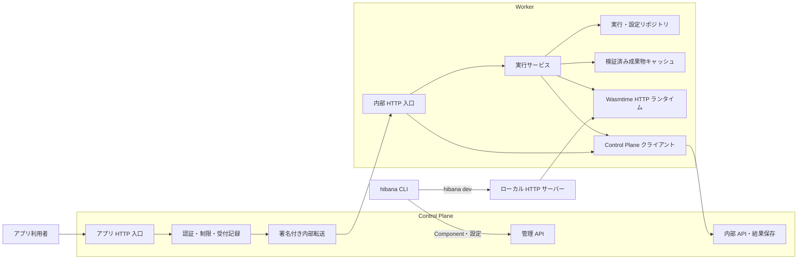

# Hibana のコード構成

Hibana の実行契約は `wasi:http/incoming-handler@0.2.3` です。言語別のビルドは CLI、HTTP の受付・認証・配備管理は Control Plane、Wasm の実行は Worker が担当します。

## プロセスと実行経路

管理 API・アプリ入口・内部 API は同じ Control Plane バイナリの別 listener です。Kubernetes では既存の Service / NetworkPolicy で到達範囲を分けます。この図はコードの責務を示すもので、各箱を別サービスとして配備するものではありません。

PostgreSQL は配備・実行記録・テナント情報の正本、Redis は共有の受付制限と一回限りのトークン管理、S3/MinIO は Wasm の保管に使います。Worker は非特権 DB ロールで実行の取得と設定の参照を行います。Secrets の復号鍵は Control Plane だけが持ちます。

## モジュールの責務

| 場所 | 責務 |
|---|---|
| `sdk/src/` | 設定読み込み、言語別ビルド、ローカル起動、管理 API への配備。Hono 専用のサーバー契約を追加しない |
| `shared/src/http.rs` | CP・dev・runtime 共通の型付き HTTP リクエスト、バイナリ符号化、本文サイズの契約 |
| `control-plane/src/bootstrap.rs` | 設定・接続・バックグラウンドタスク・listener の組立て |
| `control-plane/src/routes.rs` | URL とハンドラーの対応、認証レイヤーの適用 |
| `control-plane/src/handlers/` | 配備、実行履歴、認証、テナント、設定などの API ごとの入力検証・権限確認 |
| `control-plane/src/db/` | 同じ領域ごとの SQL。トランザクション開始・確定は呼び出し側が所有する |
| `control-plane/src/ingress.rs`, `direct_http.rs`, `completion.rs` | アプリ入口、受付と直接転送、結果保存。実行の自動再試行は行わない |
| `control-plane/src/migrations.rs` | マイグレーションの適用と検査。適用済み SQL は書き換えない |
| `worker/src/main.rs`, `config.rs`, `lifecycle.rs` | 起動、設定、停止・ドレイン・probe |
| `worker/src/direct_http.rs` | 一回限りのトークン引換え、同時実行枠の確保、HTTP 応答への変換 |
| `worker/src/service.rs` | 実行の取得 → 設定・Secrets・成果物の解決 → runtime 呼出し → 結果保存を統括 |
| `worker/src/repository.rs` | テナントを設定した DB トランザクションで実行を取得し、承認済み設定を解決 |
| `worker/src/artifacts.rs` | SHA-256 検証、ローカルで生成した cwasm、LRU、同じ成果物のコンパイル重複抑制 |
| `worker/src/control_plane.rs` | 固定した内部 URL へのジョブ・Secrets 引換えと冪等な結果保存 |
| `worker/src/runtime/` | Wasmtime Store、WASI ホスト、実行制限、外向き通信、HTTP ストリーム。DB・配備管理・Axum には依存しない |
| `worker/src/dev.rs` | インフラ資格情報なしのローカル HTTP サーバー。同じ runtime を使用 |

パスの `shared/`・`worker/`・`control-plane/` は `crates/` 配下です。Secrets の API と暗号処理は既存の `handlers_secrets.rs`・`secrets.rs`・Worker の `env.rs` に閉じ、平文取り出しの許可ファイルを広げていません。

## 変更時に守る境界

- runtime に DB、Control Plane クライアント、HTTP サーバーからの逆向きの依存を入れない。必要な Component・HTTP リクエスト・承認済み環境変数・実行制限・接続先を `Invocation` で渡す。
- `db/` は HTTP のステータスやハンドラーを参照しない。既存の `db::...` 公開口を維持し、トランザクションと RLS の確認を追跡できるようにする。
- テナントの DB 操作は同じトランザクション上の `set_config(..., true)` とバインドパラメーターを使う。Worker の実行取得は `pending` から `running` への条件付き更新で一度だけ行う。
- runtime が返すのは HTTP ストリームとステータス・利用量。汎用 bytes handler やバッファリングした JSON 出力への別経路を増やさない。実行記録にレスポンス本文を保存しない。
- ストリームは最大 16 KiB のチャンクを最大 4 個キューに保持する。正常な EOF はハンドラー完了と結果保存の後に届ける。保存失敗はストリームのエラーとし、関数を再実行しない。ヘッダー送信後は HTTP ステータス自体を変更できない。
- ローカルと本番の WASI 実行制限は共通にする。認証、共有クォータ、Secrets の引換えなどの配備先固有の処理はサービス側で行う。

`python3 scripts/check-architecture.py` は禁止した層への import / パス参照を検査する簡易ガードです。`scripts/rls-lint.sh`、Rust テスト、実 PostgreSQL の HTTP 受入試験、CLI の実 Wasmtime / 配備試験と合わせて検証します。

## MVP の判断

この整理では常駐サービス・公開 API・DB スキーマ・言語別ランタイムを追加しません。三つの Rust crate と既存の CLI を維持し、独立した変更単位をモジュールで表します。コンパイルの別プロセス化、テナントごとの強い隔離、配備と vars の原子的な切替は別の設計課題です。[MVP の範囲](mvp.md)と[セキュリティ境界](security.md)で優先順位と受入条件を管理します。
