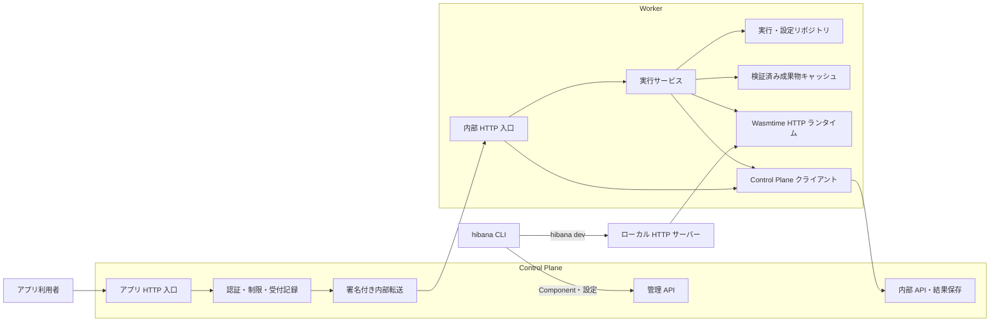

# Hibana のコード構成

Hibana の実行契約は `wasi:http/incoming-handler@0.2.3` です。言語別のビルドは CLI、HTTP の受付・認証・配備管理は Control Plane、Wasm の実行は Worker が担当します。

汎用処理は既存ライブラリに委ねます。OIDCは`openidconnect`、Cookieの生成・解析は`cookie`、暗号・TLSは`ed25519-dalek`／RustCrypto／`rustls`、DBはSeaORM、符号化は`base64`／`hex`、CIDR判定は`ipnet`、Workerの一時ファイル作成・置換・削除は`tempfile`、秘密値の破棄時消去は`zeroize::Zeroizing`、Workerの停止通知はTokioの`CancellationToken`を使用します。Hibana側にはテナント境界、権限、実行契約など固有の処理を置きます。SDKのnpmバージョン判定は`semver`、Consoleのクラス結合はTailwind CSS 4対応の`tailwind-merge`に委ね、独自テーマは公開設定APIで登録します。

Node API などの追加機能はユーザーがアプリへ同梱する JS／Wasm 部品として扱い、本体のホスト ABI を増やしません。CLI が必要な部品を合成し、既存の配備経路へ一つの Component を渡します。責任範囲は[アプリ拡張](application-extensions.md)を参照してください。

拡張パッケージはアプリの依存として明示的に導入し、`hibana.json`の`extensions`に宣言します。ローカル拡張も同じ宣言形式で扱います。CLIが宣言形式の版・HTTP契約・必要権限・部品の競合を確認し、WITとWasmの合成をビルド時に行います。拡張の追加によってホスト権限は増えません。認証・資源制限・通信許可は基盤の責任とし、Node互換などのライブラリは任意のアプリ依存として配布します。

CLIは独立したnpmパッケージです。HTTPS管理APIへのアプリ操作、PC用ランタイムでの`dev`、明示的なKubernetes資格情報を使う管理者の基盤操作を分離しています。`dev`は未導入のPC用ランタイムを自動取得します。CLIから基盤ソースやローカルDockerを暗黙に参照しません。[配布とリモート接続の構成](remote-cli.md)を参照してください。

開発者のPCと実行先のKubernetesサーバーは別端末を前提とします。`console/`のReact画面はKubernetes上の独立したNginx Deploymentから静的ファイルを配信し、PCのブラウザとCLIが同じ管理APIを操作します。配備済みアプリの実行・配信はPCの稼働に依存しません。[コンソールの導入・認証・検証](console.md)を参照してください。

## Kubernetesを前提とする本番構成

本番はKubernetes上のControl Planeと常駐Workerで運用します。Deployment・Service/DNS・readiness・終了猶予・必要に応じたHPAで、Workerの配置と増減を管理します。アプリはComponentとして配備し、既存Worker内のWasmインスタンスで実行します。アプリやリクエストの数に対応するPod・Jobは作成しません。

Podの更新・追加と、呼び出しごとのWasmインスタンス生成は別の処理です。Workerはコンパイル済みコードを再利用し、各呼び出しのStore・環境・実行制限を分離します。低遅延の実行に使うWorkerは常駐させ、追加Workerでは成果物の準備を終えてから実行を受け付けます。具体的な上限と動作は[スケール方針](scaling.md)を参照してください。

`runtime/`はローカル開発と本番で共有するため、Kubernetes APIから独立したまま維持します。本番向けの別の配置方式や独自クラスタ管理は実装しません。PostgreSQL・Redis・S3互換ストレージの接続先は導入先で設定でき、クラスタ外のサービスも利用できます。

## プロセスと実行経路

管理 API・アプリ入口・内部 API は同じ Control Plane バイナリの別 listener です。Kubernetes では既存の Service / NetworkPolicy で到達範囲を分けます。この図はコードの責務を示すもので、各箱を別サービスとして配備するものではありません。

PostgreSQL は配備・実行記録・テナント情報の正本、Redis は共有の受付制限、一回限りのトークン管理、短命な実行完了通知、S3/MinIO は Wasm の保管に使います。Worker は非特権 DB ロールで実行の取得と設定の参照を行います。Secrets の復号鍵は Control Plane だけが持ちます。

DBの構成、テーブル一覧、空DBからの作成と既存DBの切替方針は[基盤DB](database.md)を参照してください。

## モジュールの責務

| 場所 | 責務 |
|---|---|
| `sdk/src/` | 設定読み込み、言語別ビルド、ローカル起動、管理 API への配備。Hono 専用のサーバー契約を追加しない |
| `shared/src/http.rs` | CP・dev・runtime 共通の型付き HTTP リクエスト、バイナリ符号化、本文サイズの契約 |
| `shared/src/capabilities.rs` | CP・Worker 共通の版に固定されたimportと環境変数名。現行のオブジェクト形式を読み、欠損・不正値による暗黙の許可を防ぐ |
| `shared/src/subprocess.rs` | Tokioによる検証・コンパイル子プロセスの共通管理。入力送信中も含む時間上限、受信中の出力上限、キャンセル時の終了・回収、回収完了までの受付枠保持 |
| `shared/src/metrics.rs` | CP・Worker共通のPrometheus登録・テキスト出力・応答時間バケット。各プロセスのメトリクス定義はそれぞれの`metrics.rs`に置く |
| `control-plane/src/bootstrap.rs` | 設定・接続・バックグラウンドタスク・listener の組立て |
| `control-plane/src/routes.rs` | URL とハンドラーの対応、認証レイヤーの適用 |
| `control-plane/src/handlers/` | 配備、実行履歴、認証、テナント、設定などの API ごとの入力検証・権限確認 |
| `control-plane/src/validation.rs` | 隔離プロセスで Component・HTTP export・固定の WASI ホスト契約を検証。アプリ独自の import は事前合成を必要とする |
| `control-plane/src/db/` | 同じ領域ごとの SeaORM リポジトリ。トランザクション開始・確定は呼び出し側が所有する |
| `control-plane/src/ingress.rs`, `direct_http.rs`, `completion.rs` | アプリ入口、受付と直接転送、結果保存。実行の自動再試行は行わない |
| `control-plane/src/dispatch.rs` | DNSによるWorker発見、接続再利用、実行前の容量不足・準備未完了の拒否に限った別Workerへの転送 |
| `control-plane/src/preparation.rs`, `shared/src/preparation.rs` | 公開前のコンパイル依頼、追加Workerへの再配置、実行権限とは分離した短命の署名付き準備トークン |
| `database/src/` | CP・Worker 共通の SeaORM Entity、版IDの結合条件、PostgreSQL接続とテナント設定 |
| `migrations/src/` | 固定した初期スキーマと以後の差分。テーブル・制約・索引は Rust、RLSとDB関数はSQLで管理 |
| `control-plane/src/migrations.rs` | 専用の所有者接続でマイグレーションを適用。空DBの確認と同時適用の直列化 |
| `worker/src/main.rs`, `config.rs`, `lifecycle.rs` | 起動、設定、停止・ドレイン・probe |
| `worker/src/direct_http.rs`, `capacity.rs` | トークン引換え、同時実行枠・承認済みメモリ上限の予約、HTTP応答への変換。実行はDBで一度だけ取得する |
| `worker/src/service.rs` | 設定の解決、実行の取得 → Secretsの解決 → 準備済みComponentによるruntime呼出し → 結果保存を統括 |
| `worker/src/repository.rs` | テナントを設定した DB トランザクションで実行を取得し、承認済み設定を解決 |
| `worker/src/artifacts.rs` | SHA-256 検証、認証済みのcwasm、import解決済みComponentのLRU、同じ成果物のコンパイル重複抑制 |
| `worker/src/control_plane.rs` | 固定した内部 URL へのジョブ・Secrets 引換えと冪等な結果保存 |
| `worker/src/runtime/` | Wasmtime Store、WASI ホスト、実行制限、外向き通信、HTTP ストリーム。DB・配備管理・Axum には依存しない |
| `worker/src/dev.rs` | インフラ資格情報なしのローカル HTTP サーバー。同じ runtime を使用 |

パスの `shared/`・`worker/`・`control-plane/` は `crates/` 配下です。Secrets の API と暗号処理は既存の `handlers_secrets.rs`・`secrets.rs`・Worker の `env.rs` に閉じ、平文取り出しの許可ファイルを広げていません。

## 変更時に守る境界

- runtime に DB、Control Plane クライアント、HTTP サーバーからの逆向きの依存を入れない。必要な Component・HTTP リクエスト・承認済み環境変数・実行制限・接続先を `Invocation` で渡す。
- `db/` は HTTP のステータスやハンドラーを参照しない。既存の `db::...` 公開口を維持し、トランザクションと RLS の確認を追跡できるようにする。
- テナントの DB 操作は同じトランザクション上の `set_config(..., true)` とバインドパラメーターを使う。Worker の実行取得は `pending` から `running` への条件付き更新で一度だけ行う。
- 転送失敗・中断のキャンセルも`pending`だけを更新する。Workerが先に取得した実行の枠を解放しない。明示的な実行前拒否だけは別Podへ送れるが、ゲストの応答や通信切断は再送の根拠にしない。
- runtime が返すのは HTTP ストリームとステータス・利用量。汎用 bytes handler やバッファリングした JSON 出力への別経路を増やさない。実行記録にレスポンス本文を保存しない。
- 対話ログインはRustの`openidconnect`を使うOIDCクライアントに限定する。本人認証・パスワード・MFAは外部基盤が担当し、HibanaはOIDC stateの単回消費、テナント所属、権限、セッション失効を管理する。通信量と応答サイズを制限し、OIDC開始はIP別と全体のレート制限を使う。詳細は[認証・OIDC](authentication.md)。
- HTTP 入力は Worker への引き渡し用に一時保存し、完了・受付取消・孤立実行の回収と同じトランザクションで破棄する。実行一覧・詳細 API は、実行中も含めて入力・出力本文やその保存先参照を返さない。旧 CP の完了処理で残った入力は、停止中を含む全テナントの定期清掃で回収する。
- 同名ヘッダーのバイト列と順序をWorkerまで保持する。`headers`は名前ごとの全値を順序どおりBase64url化した配列で、一度だけ保持する。符号化は`base64`、JSON処理はSerde、復元時の名前・値の検証は`http`に委ねる。ローカルdevも同じ変換を使い、旧形式や不明な項目は拒否する。
- 公開リクエストの URL と Host は `APP_PUBLIC_ORIGIN` と解決済みのアプリ・テナントから作る。HTTPS と外部ポートを Worker へ引き継ぎ、クライアントの `Forwarded` / `X-Forwarded-*` を URL の根拠にしない。ローカル dev は接続先の Host・ポートを維持する。
- アプリ名とテナント slug は作成時に公開 URL と共通の規則で検証する。1〜63 文字の半角英小文字・数字・ハイフンを許可し、先頭・末尾のハイフンは拒否する。テナント slug の前後の空白は従来どおり除去し、作成応答にも保存後の値を返す。
- ストリームは最大 16 KiB のチャンクを最大 4 個キューに保持する。正常な EOF はハンドラー完了と結果保存の後に届ける。保存失敗はストリームのエラーとし、関数を再実行しない。ヘッダー送信後は HTTP ステータス自体を変更できない。
- 結果保存APIは署名と実行・テナント・バージョンの対応を一度検証し、対象行のロックから状態更新・利用量集計までを単一トランザクションで行う。同じ終端状態の再送は成功、異なる終端状態への上書きは409とし、メトリクスもコミット成功後だけ更新する。
- 実行・Secret引換え・成果物準備の内部トークンは、符号化・署名検証を共通化し、用途ごとの署名対象とドメイン分離を維持する。内部署名鍵は設定済みの1本と鍵IDを使い、署名・厳格な検証は`ed25519-dalek`に任せる。アプリ署名用の公開鍵も同じライブラリで検証し、厳格な検証に使えない弱い鍵は登録時に400で拒否する。
- 完了通知は本文キューから分離し、成功時だけ確定する。読み取りを止めたクライアントにも、タイムアウトの記録と実行枠・予約メモリの解放は妨げられない。Wasm の異常終了時は応答待ちを打ち切り、トラップを実行履歴に記録する。
- HEAD・204・304 のように本文を転送しない応答は、ハンドラー完了と結果保存までヘッダーも待つ。失敗時は成功応答を確定せず 502 を返す。ローカル dev もハンドラー完了まで待つ。
- ローカルと本番の WASI 実行制限は共通にする。認証、共有クォータ、Secrets の引換えなどの配備先固有の処理はサービス側で行う。
- 公開 HTTP の受信から Worker 応答ヘッダー待ちまでを CP プロセスあたり8件に制限し、満杯なら待ち行列を作らず `503 request_capacity` と `Retry-After: 1` を返す。ボディを読む前にテナント状態・レート・テナント別受信枠も確認する。受信枠はテナントの同時実行上限までで、超過は429となる。これらは各 CP のバッファを守るローカルの枠であり、全 CP 共通の実行数は引き続き PostgreSQL で制限する。
- リクエスト本文は最大8 MiB、受信開始から完了まで10秒。超過は413、受信期限切れは408となり、実行記録を作らず枠を解放する。切断・キャンセルでも枠を解放し、受信中は DB トランザクションを保持しない。受信後にテナント状態・同時実行上限を再確認し、レートを二重に消費しない。
- デプロイ用 Wasm アップロードは CP プロセスあたり4件、テナントあたり2件まで。受信前に枠を確保し、検証・ストレージ保存・公開まで保持する。満杯なら待機せず `503 upload_capacity`（CP全体）または `429 upload_capacity`（テナント）と `Retry-After: 1` を返す。受信全体の期限は60秒で、期限切れは `408 upload_timeout`。切断・エラーでも枠を解放する。検証は受信済みバッファを借用し、本体のコピーや検証待ちの行列を作らない。Wasmは既定32 MiB、付随する文字列フィールドは各256 KiB、全体で最大16フィールドまで。
- Wasmtime の HTTP fields は名前・値とその構造体の計算量を合わせて1リソース512 KiBまで、ホストリソーステーブルは実行あたり128個まで。個別の容量に加えて、大量のfieldsを同時保持する経路も個数で制限する。入力と外向き HTTP の応答も同じ容量検査を通し、cloneや別のHTTPリソースへの移動で上限を回避できないようにする。これはゲストの線形メモリ上限とは別の制限で、通信中の一時バッファやランタイム全体のメモリを表す値ではない。

`python3 scripts/check-architecture.py` は禁止した層への import / パス参照を検査する簡易ガードです。`scripts/rls-lint.sh`、Rust テスト、実 PostgreSQL の HTTP 受入試験、CLI の実 Wasmtime / 配備試験と合わせて検証します。

外向き HTTP は接続期限に加え、WASI の応答開始期限と本文の受信間隔の期限を実際の通信待ちに適用します。応答開始期限は送信開始からヘッダー・最初の本文の受信まで共通で、その後は本文が届くたびに受信間隔の期限を更新します。期限切れは `connection-read-timeout` としてゲストへ返します。応答本文は最大64 MiB、送信本文は最大8 MiBのバッファ方式です。両方のバッファ用に、実行あたり128 MiB・Runtime（Worker）あたり256 MiBの共有枠を設けます。伸長時の旧・新バッファも確保前に計上し、容量不足は `internal-error`（`outbound HTTP buffer capacity exhausted`）として待機せず返します。応答を読み出した後も、最後の本文データやそのsliceが破棄されるまで容量を返しません。この枠はHibanaが保持する本文バッファの確保量であり、ゲストの線形メモリ・HTTPライブラリの通信バッファ・Worker全体のRSSとは別です。

DNS は実行前に承認済みホストだけを解決し、IP 制限を通過したホスト名・IP・ポートを実行単位で固定します。WASI の名前解決と外向き HTTP はこの結果を使い、ゲスト指定の未承認ホストを OS に問い合わせません。外向き HTTP の接続候補には、対象ホスト・ポートの許可済み IP をすべて渡します。先頭の IP に接続できない場合は接続期限内に別候補を試し、Host と TLS の検証名には元のホスト名を使います。この接続候補の切り替えは HTTP 送信前に限り、送信後の切断や 503 応答を理由に別 IP へリクエストを送り直しません。承認済み IP の直接指定も接続時のポート制限を受けます。別名やサブドメインは個別の承認が必要です。

外向きIPの判定は`ipnet`に委ね、拒否する範囲をデータとして定義します。IPv4は`0.0.0.0/8`を含むローカル・特殊用途範囲を拒否します。IPv4-mapped IPv6は元のIPv4に正規化して同じ制限を適用します。ネイティブIPv6は[IANAのグローバルユニキャスト範囲](https://www.iana.org/assignments/ipv6-address-space/)である`2000::/3`から、プロトコル割当`2001::/23`・文書用・廃止済み範囲・6to4を除外します。NAT64・Teredoなどの変換・トンネル方式はサポートしません。運用者が指定したRFC1918のTCP接続先と、ローカル開発の明示的な接続許可は別のポリシーで扱います。

共有ストアの`InProcStore`・`FailingStore`は`control-plane/src/store/test_support.rs`に置き、テスト時だけコンパイルします。実行時はRedis実装を使います。Workerの`wasmtime_memory_pages`は計測処理がなく常に0だったため削除しました。実際に更新するメモリ予約量・予算のメトリクスは引き続き公開します。

レート制限の補充時刻はRedisの[`TIME`](https://redis.io/docs/latest/commands/time/)から取得し、Luaスクリプト内で残量更新と一緒に確定します。Control Planeごとの時計は使わず、Redisの時計が戻った場合も前回の補充時刻を保持して同じ時間を二重計上しません。テストの時刻制御はTokioの仮想時計を使います。

ライブ監視の`hibana tail`は、完了トランザクションのコミット後にRedis Streamsへ実行IDを通知します。監視中のアプリごとに最大1,000件・最終取得から90秒のバッファを持ち、本文はRead認証とRLSを通してDBから取得します。通知待ちは完了処理1件またはreaperの1テナント分につき最大100msで、通知失敗は確定済みの実行結果を変更しません。再接続時の欠落検出と保存ログとの違いは[アプリログ](application-logs.md)を参照してください。

通知の取得前にDBトランザクションを終了し、Redisの応答待ちでDB接続を占有しません。通知がある場合だけ別のテナントトランザクションで本文を取得します。実行履歴とライブ監視の列選択・ログ保存期限・テナント条件はDB層の同じクエリを使います。

## デプロイ時の設定

`handlers/deployment.rs`がvarsとSecret名を検証し、`version_configs`・`version_secret_bindings`へ版ごとの設定を保存します。`handlers/components.rs`が公開トランザクションを所有し、Secret利用許可の確認とactive版の切替までをまとめます。HTTP受付は版IDをexecutionへ固定し、WorkerはそのIDからvarsを取得します。Secretsの復号はCP内に閉じ、版が参照するSecretのIDとexecutionの受付時刻から値を解決します。[移行と権限の仕様](deployment.md)を参照してください。

外部通信の許可は管理者がアプリ単位で設定し、`components.egress_policy`だけに保存します。Workerは版の固定設定と同じクエリで現在のアプリ設定を取得します。版への許可の複製や旧版単位の承認APIはありません。

## 公開前のコンパイル

実行先が設定されている場合、デプロイはWasm保存後にDNSで発見したWorkerへ`/prepare`を送り、全応答の成功後に公開トランザクションへ進みます。コンパイル中にDBの公開ロックを保持しません。準備失敗は503となり、旧版のactive設定は維持されます。rollback・active版の明示切替も対象版を準備してから行います。準備先は`WORKER_PREPARATION_URL`、省略時は`WORKER_HTTP_URL`です。Kubernetesでは前者が未Ready Podを含む専用Service、後者がReady Podだけを返すServiceを参照します。両方とも未設定の管理専用プロセスではWorker準備を省略します。

S3へのPUT前に`artifact_reservations`へ保存先・版ID・ハッシュを記録します。PUT成功後に公開が失敗した場合は未登録オブジェクトを削除します。プロセス中断や削除失敗で残った記録は、有効期限の5分経過後に30秒周期の回収処理で再試行します。公開と回収は同じ記録の行ロックで直列化し、DBに登録済みの版が参照するオブジェクトは保持します。CPのS3資格情報には対象バケットの`DeleteObject`権限も必要です。

`/prepare`は専用の署名を内部APIで検証し、SHA-256が一致するWasmだけを制限付き子プロセスでコンパイルします。ゲストのhandlerやSecrets引換えは実行しません。HTTP実行ではメモリLRU→ローカルcwasm→認証済み共有キャッシュ→元Wasmの取得・コンパイルの順にコードを解決します。ローカルにない場合は、署名済み実行トークンを`/internal/execution-artifact`で引き換えます。CPはpendingのHTTP実行・テナント・固定された版・削除状態をDBで検証し、その版だけの短命なURLと準備トークンを発行します。リクエストのbodyで保存先を指定できません。コンパイル済みComponentはWASIのimportを解決した`InstancePre`として同じLRUに保持します。ローカルcwasmからの再読込時もimportを解決します。取得した`PreparedComponent`の`Arc`を実行終了まで保持するため、その後のキャッシュ追い出しで再コンパイルされることもありません。各リクエストのStore・インスタンスは引き続き新規です。

準備確認と実行用の読み込みは分離しています。`/prepare`はディスク上のコードが実行可能であることを検証し、HTTP用LRUの内容や使用順を変更しません。HEADによる確認では、検証済みのファイル情報だけを最大256件保持し、同じファイルへの再確認ではコードを読み直しません。共有先が有効な場合のPOSTは、再公開する成果物を共有先にも残すため、ローカルのコードを読み直して保存します。ファイルの削除・置換・変更時には再検証します。ディスクにない成果物をメモリだけのキャッシュヒットで公開可能とは判断しません。HTTP用LRUにコードを残すのは実際のリクエストだけです。

全公開アプリを定期巡回して読み込む処理はありません。WorkerはDB・実行エンジン・HTTPの初期化後にReadyとなり、空のキャッシュで受付を始めます。復元中は同時実行枠を保持しますが、DBのpending→runningはコード取得後です。復元全体を85秒で打ち切り、失敗時は実行前の503を返します。復元後にトークン・テナント・版・現在の権限を再確認し、実行前に無効化されたリクエストを起動しません。同じ成果物の復元は固定32本のロックでまとめ、ダウンロード・検証もコンパイル枠内に収めます。CPの内部HTTP idle-read期限は120秒です。

標準のRollingUpdate構成では、計画的なPod終了時に`preStop`で35秒待ち、古いheadless ServiceのDNS応答（30秒TTL）を使う接続にも応答します。その後SIGTERMで通常のdrainへ進みます。既定の終了猶予90秒にはこの待機時間も含まれます。DNSのTTLを長くする環境では両方の猶予を調整してください。新旧Podを並行起動する空き容量が前提です。最小VPS用のRecreate構成ではこの待機を外します。強制終了・OOM・ノード障害による通信断を隠す仕組みではありません。

ディスクキャッシュはWorkerごとに既定2 GiB・256成果物が上限です。`WORKER_CACHE_DISK_MIB`で1〜2048 MiBに縮小できます。公開中でもローカルキャッシュは退避でき、元Wasmはストレージへ保持します。古い最終使用時刻のファイルから削除し、実行による時刻更新は30秒単位に間引きます。保存失敗や単一成果物が設定上限より大きい場合は、検証済みコードで処理を続け、実行用LRUへ保持します。デプロイの成功は実行可能性の検証を意味し、ディスクへの常駐を保証しません。実行中の参照を保持するため、ファイルの退避で実行を中断しません。

上限は名前付きキャッシュファイルの論理量です。原子的置換の一時ファイルや、実行中・LRU内の参照が保持する削除済みのファイル領域、コンパイラ用一時ファイルは別途余裕が必要です。ノード全体の空き容量・Podのephemeral-storage・RSS制限は引き続き監視します。多数のアプリを保存できますが、すべてを同時に高速実行できる保証ではなく、キャッシュの入替えが増えると復元待ちや503が増えます。

`COMPILED_CACHE_KEY`をControl PlaneとWorkerに設定すると、既存のS3互換バケットの`_hibana/compiled/v1/`へコンパイル結果を共有します。キーはWasmtimeの互換性ハッシュ（エンジンの版・設定・CPUターゲット）と元WasmのSHA-256で分けます。新しいPodの準備では、ローカル→共有キャッシュ→元Wasmの取得・コンパイルの順に試します。共有データのHMAC-SHA-256を照合してからのみ、Wasmtimeのunsafeなデシリアライズへ渡します。署名は元Wasmと実行環境にも結びつけます。アプリ利用者やコンパイラ子プロセスへ鍵は渡しません。読み込み後に実行可能性を検証し、ローカル保存を試みます。公開前準備ではHTTP用LRUを変更せず、実際のリクエストだけがLRUへコードを保持します。

Garageなどの共有先では、未削除アプリの公開中の版・直前のロールバック先・pending/runningの実行・期限内の準備予約が参照するコンパイル結果を保持します。停止中のテナントも対象です。元WasmのSHA-256で全テナントの参照を合算し、同じコードを複数アプリで使う場合は最後の保護対象がなくなるまで保持します。互換性キーが異なる成果物も、その元Wasmに参照がある間は保持します。これらは2 GiB・256件の制限から除外するため、アプリ数が増えても容量制限を理由に公開版のコンパイル結果を削除しません。

2 GiB・256件は保護対象を除いた古いキャッシュにだけ適用します。Control Planeが内部の準備トークンとHMACを検証し、保存前に参照のない古い保存日時のオブジェクトから回収します。元Wasmや別のprefixは削除しません。最終実行日時ではなく保存日時で古さを判定します。参照取得に失敗した場合は削除を中止します。削除対象の列挙と保存はPostgreSQLのadvisory lockでControl Plane間を直列化し、準備予約の作成・公開トランザクションも同じロックの共有側を取得します。コンパイルやWorkerへの通信中は公開ロックを保持しません。古い版を再公開する際、Podにだけ残っているコンパイル結果も準備中に共有先へ保存し直します。HTTPのキャッシュヒットではこの保存処理を行いません。

受信は各CPで1件・128 MiB+署名32バイトに制限します。共有キャッシュの欠落・改ざん・読取り失敗は元Wasmのコンパイルへフォールバックし、共有保存の失敗はローカルの準備成功を取り消しません。保持は保存済みオブジェクトの自動回収を防ぐ仕組みであり、保存失敗・手動削除・互換性変更による再コンパイルをなくす保証ではありません。新しいデータの受信・検証・保存もWorkerのコンパイル枠内に収めます。

この上限は保護対象外の最新オブジェクトの論理サイズです。保護対象の成果物、S3の旧版・削除マーカー・Garageの物理的な回収待ちは別途容量を消費します。Garage全体の使用量はアプリ数・ロールバック先・実行環境の種類に応じて増えるため、空き容量を監視してストレージを拡張します。障害時の遅延PUTなどで保護対象外の枠が一時的に超過した場合は次回の保存時に回収します。キャッシュ用prefixで履歴を残す場合は、ストレージ側のライフサイクルも設定してください。共有キャッシュがあってもPod起動、ダウンロード、コード読込みには時間がかかり、起動時間がゼロになるわけではありません。Podごとの容量を超えたアプリも必要時に復元するため、全公開アプリの常駐は必要ありません。

`hibana_worker_shared_cache_total{outcome}`でhit・miss・invalid・unavailable・stored・store_failedを計測します。`wasmtime_component_cache_misses_total`は実際に元Wasmの取得・コンパイルへ進んだ回数です。 128 MiBのローカル枠で8個のHonoアプリを切り替えた結果は[容量超過時の検証](vps-demand-cache-validation.md)に記録しています。

`PreparedComponent`の生成時には、Wasmtimeの`initialize_copy_on_write_image`で初期メモリの共有用イメージも準備します。特にLinuxでメモリ上のcwasmから読み込む場合、最初のインスタンス生成まで遅延されるmemfdへの書込みをここで済ませます。コンパイル後の読込み・メモリイメージ作成はblockingタスクで行い、HTTPを処理する非同期実行スレッドを占有しません。ゲストのstart関数・handlerは事前に実行しません。

## HTTP経路の固定費と計測

Control Planeは受付トランザクションで確定した版IDをそのまま署名処理へ渡し、転送直前の実行レコード再読込を行いません。成果物ダウンロードURLは認証された準備APIと実行時復元APIだけが発行します。実行時の版は署名済みトークン内の版IDで固定し、ジョブには未使用の版名やダウンロードURLを含めません。トークン検証、テナント境界、Workerの一度だけの実行取得、応答EOF前の結果保存は維持します。

Workerとローカル開発の各Runtimeは、10ms間隔でWasmtimeのepochを進めるスレッドを一つ持ちます。リクエストごとのスレッド生成は行いません。各Storeのコールバックがその実行自身の絶対期限を確認し、期限前は非同期実行をいったん譲ります。CPUを使い続けるWasmでもHTTPやヘルスチェックの処理が進み、別の実行のタイムアウトでは中断しません。Runtimeの破棄時に共有タイマーを停止します。

Workerの`max_execution_time_ms`は、実行取得後のSecrets取得・許可済み外部通信先のDNS解決・Runtime呼出しを共通の期限で制限します。DNSが遅くても通信先ごとに期限は延長しません。期限切れは`timeout`として結果保存し、実行枠と予約メモリを解放します。成果物準備・DBでの実行取得・結果保存はこの期限の対象外です。

WorkerはSeaORMの接続プールを使用し、起動時から2本の接続を維持します。最大接続数が1本なら1本です。テナント設定は各トランザクション内だけに適用します。SQL文を固定した手動のprepare処理は持たず、ORMとPostgreSQLドライバーがクエリを管理します。

`RUST_LOG=info,hibana_latency=debug`で、受付・転送準備・Worker発見・トークン引換え・設定取得・キャッシュ取得・実行取得・Runtime・結果保存の所要時間をマイクロ秒単位で記録できます。実行IDで関連づけ、トークン・Secrets・本文はこの計測ログに出しません。`wall_time_ms`はWorker内の実行取得・環境構築・Runtime呼出しの範囲であり、HTTP全体や結果保存の時間とは異なります。

初回のメモリイメージ準備は`component_preparation`、WorkerのDB接続取得・BEGIN・テナント設定・UPDATE・COMMITは`worker_claim_db`としてさらに分けて記録します。

CPの管理・内部・アプリHTTP、Workerの実行HTTP、ローカルdevは、受け付けたTCP接続で`TCP_NODELAY`を有効にします。ヘッダー・本文のチャンク・完了を分けて送る際に、小さな送信がNagleのアルゴリズムによって待たされることを避けます。本文のバッファ上限や結果保存後にEOFを返す順序は維持します。

## MVP の判断

Rust workspaceはControl Plane・Worker・共有型・DBモデル・マイグレーションの5 crateで構成し、CLIを独立したパッケージとして維持します。過負荷制御は既存プロセスに置き、DBには受付件数確認のための部分インデックスを追加しました。自動増減にはKubernetes標準HPAを任意で使います。コンパイルは制限付き子プロセスへ分離し、配備ではバージョンごとのvars・Secret参照とactive版を単一DBトランザクションで公開します。テナントごとのプロセス・資格情報の分離は引き続き別の設計課題です。[MVPの範囲](mvp.md)、[スケール](scaling.md)、[セキュリティ境界](security.md)で優先順位と受入条件を管理します。
