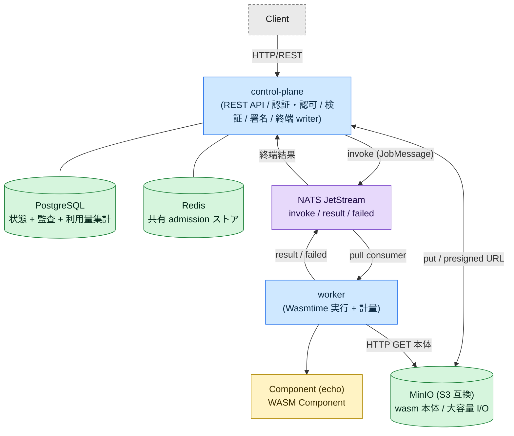
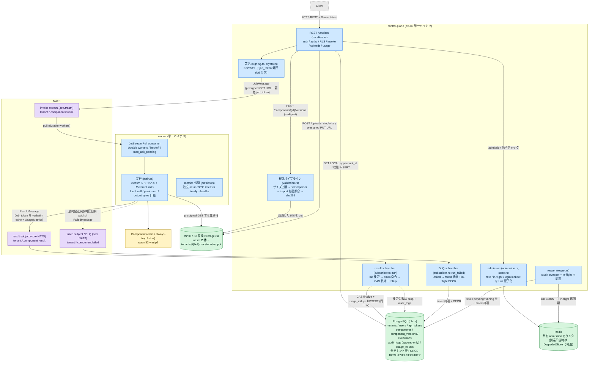
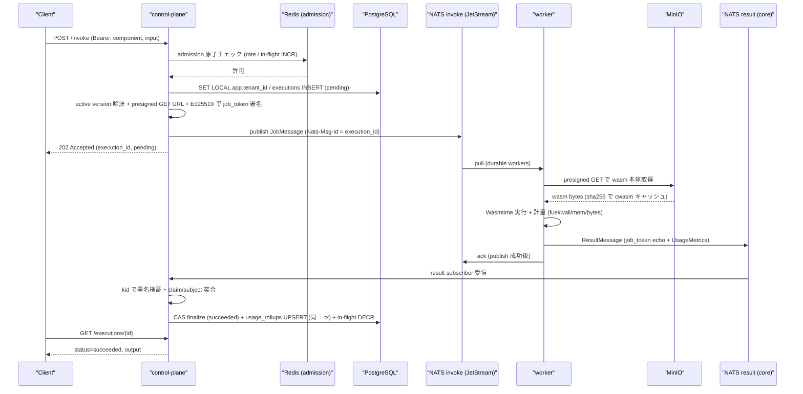

# アーキテクチャ（WASM FaaS Platform）

> 基準: ブランチ `feat/m6`（実体は **M5: 課金・メータリング基盤** 時点）、2026-06-25。
> この図はコードベース（`crates/*` / `migrations/*` / `wit/*`）を唯一の正として起こしている。
> 既存の説明文と食い違う場合はコードを信じること。

対象は 3 つの成果物（`control-plane` / `worker` / `components/echo`）と、4 つの依存ミドルウェア
（PostgreSQL / NATS JetStream / Redis / MinIO）。粒度別に 3 枚用意した。

- [25% — コンテキスト図](#25--コンテキスト図全体像) … 新規参加者・発表向け
- [100% — コンポーネント / データフロー図](#100--コンポーネント--データフロー図) … 実装者・レビュアー向け
- [invoke→result シーケンス図（本番 default 経路）](#invokeresult-シーケンス図本番-default-経路)

---

## 25% — コンテキスト図（全体像）

---

## 100% — コンポーネント / データフロー図

`control-plane`（axum 単一バイナリ。内部に複数の非同期タスク）と `worker` の責務分割、
依存ミドルウェアへの経路、メッセージの中身を実装に忠実に描いている。
括弧内は対応するソース（`crates/control-plane/src/*` など）。

ポイント（実装上の不変条件）:

- **worker は署名鍵を持たない**。`job_token` を全 result に verbatim に echo するだけで、
  検証は control-plane の subscriber が kid で公開鍵を選んで行う（§3.3 MUST NOT）。
- **二重計上が構造的に不可能**: `usage_rollups` の UPSERT は CAS finalize が状態を遷移させた
  同一トランザクション内でのみ走る。再配送 / DLQ 後着 / sweeper 先着では CAS が no-op になり
  rollup を触らない（冪等アンカー, §15）。
- **Redis は速い近似、DB COUNT が唯一の真実**。reaper が定期的に in-flight を再同期する。
- **result / failed は core NATS**（JetStream ではない）。CP 再起動で in-flight 結果が
  ドロップしうるのは既知の follow-up（README §M4 非スコープ参照）。

---

## invoke→result シーケンス図（本番 default 経路）

`Idempotency-Key` なし・インライン input・succeeded で終端する標準経路。
大容量 I/O（`POST /uploads`）と冪等再送は分岐として末尾に注記。

> 分岐: ① 大入力は事前に `POST /uploads` で `execution_id` を予約し presigned PUT で退避、
> invoke 時に `input_ref` を完全一致検証（§3.4）。② `Idempotency-Key` 提示時は 3 層冪等で
> 重複実行を防ぐ（§6.6）。③ trap / timeout は subscriber が failed/timeout 終端、
> worker 落下や無音失踪は reaper の stuck sweeper、最終配送失敗は `.failed` DLQ subscriber が回収。
