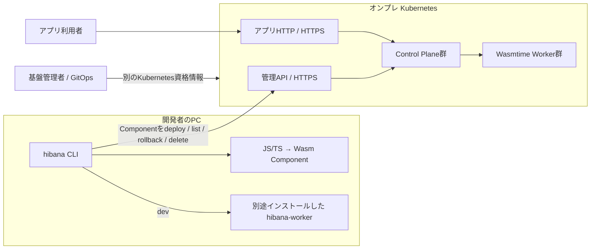

# 手元のCLIからオンプレHibanaを操作する

CLI、ローカル開発ランタイム、Kubernetes上の基盤は別々にインストールします。開発者のPCにはクラスタの資格情報を渡さず、Hibanaのテナント用認証でHTTPS管理APIを操作します。



## CLIの配布

Node.js 24以上が必要です。CLIはGitHub Releasesのtarballから導入します。npmレジストリへは公開しません。CLIの実行時にHibanaリポジトリは不要です。

```bash
# 配布担当者がリポジトリ内で実行
npm ci --prefix sdk
mkdir -p .local/dist
cd sdk
npm pack --pack-destination ../.local/dist

# 開発者のPC。配布したファイルを任意の場所に置く
npm install -g https://github.com/yukiharada1228/hibana/releases/download/v0.1.0/hibana-cli-0.1.0.tgz
hibana --help
```

パッケージに含めるのはCLI、言語テンプレート、WIT、既存クラスタを操作する小さな管理ツールとマイグレーションの公開マニフェストです。Control Plane/Workerのソース・バイナリ、Dockerfile、kind構築処理、開発用資格情報は含みません。アプリの配備・削除・Secrets操作でPython・Docker・kubectlを起動することはありません。

JS/TSのビルドには同梱のoptionalDependenciesを使います。ビルド済みWasmだけを配備するPCでは`npm install -g /path/to/hibana-cli-0.1.0.tgz --omit=optional`でJSコンパイラーを省略できます。

## 開発者の操作

管理者から管理API URL・テナント名・アカウント・アプリのドメインを受け取ります。秘密値はコマンド引数へ渡さず、stdinまたは`HIBANA_PASSWORD`で渡します。

```bash
hibana login --profile onprem \
  --url https://api.example.internal \
  --tenant team --email developer@example.internal \
  --ingress-domain apps.example.internal \
  --password-stdin < /secure/login-password.txt

hibana profile list
hibana profile use onprem

hibana init hello --template hono
cd hello
hibana deploy --profile onprem --version 1.0.0
curl https://hello.team.apps.example.internal/
hibana list --profile onprem
hibana rollback --profile onprem
# 削除はテナント管理者として別途ログインしたプロファイルで実行
hibana delete hello --profile onprem-admin --yes
hibana logout --profile onprem
```

`init`の既定はCLIと同じバージョンのGitHub Release URLを依存として指定し、開発チェックアウトへの`file:`依存を生成しません。`--cli-package PATH`だけがローカルtarballや開発用ディレクトリを明示的に参照する選択肢です。通常のHonoをWasm Componentへ変換してアップロードし、実行・配置・準備済みコードの管理はオンプレのWorker群が担当します。

通常の配備はRead・Deploy、アプリ削除はRead・Adminのスコープが必要です。`onprem-admin`には同じテナントの管理者でログインしてください。

`deploy`・`rollback`・`list`・`delete`・`secret`は共通の接続先解決を使います。CLIの接続先やプロファイルは`hibana.json`に含めず、同じアプリを複数の基盤へ配備できます。

| 設定 | 動作 |
|---|---|
| `--profile NAME` | この呼び出しで使う保存済み接続先。環境の`HIBANA_URL`より優先 |
| `HIBANA_PROFILE` | CI等でプロファイルを選択 |
| `hibana profile use NAME` | PCで使う既定を切り替え |
| `--url URL` | 管理APIを明示的に上書き。別URLの保存トークンは使わない |
| `HIBANA_URL` + `HIBANA_TOKEN` | 保存不要のCI用接続。明示した`--profile`がある場合、URLはそのプロファイルを優先 |
| `HIBANA_CONFIG_HOME` | 設定ディレクトリ。既定は`${XDG_CONFIG_HOME:-$HOME/.config}/hibana` |

URLは`--url` → 明示的な`--profile` → `HIBANA_URL` → 選択済みプロファイル → 旧プロジェクト認証の順です。トークンは明示的な`HIBANA_TOKEN`、接続URLと一致する保存トークンの順です。URL未設定時にlocalhostへ接続する暗黙の既定はありません。

`profiles.json`はディレクトリ0700・ファイル0600で保存し、書き換えは一時ファイルからのrenameで行います。プロジェクトの移動やディレクトリ変更でログインし直す必要はありません。パスワードは保存せず、URLごとのトークンを保存します。同じURLの別テナントは別のプロファイル名で管理します。旧`.hibana/auth.json`も互換用に読めますが、明示的に選んだプロファイルには混ぜません。`logout`は指定プロファイルのローカルトークンを削除します。旧認証ファイルやCI環境変数のトークン、サーバー側の他セッションには作用しません。

HTTPはloopbackだけ許可し、それ以外はHTTPSが必要です。APIリダイレクトは追跡しません。社内CAの場合は、PCのNode.jsプロセスに`NODE_EXTRA_CA_CERTS=/path/to/company-ca.pem`を設定してからCLIを起動してください。TLS検証を無効化するオプションは設けていません。

## ローカル開発ランタイム

`hibana dev`はPC用`hibana-worker`を起動します。Docker・DB・Kubernetes・オンプレ接続は不要です。`--runtime` → `HIBANA_RUNTIME_BIN` → CLIと同じバージョンの管理済みランタイム → `PATH`の順に探します。CLIが基盤のRustソースを探したり自動ビルドしたりすることはありません。

```bash
hibana runtime install
# 閉域環境: hibana runtime install --from FILE --sha256 HASH
hibana dev
# Ctrl+Cで開発サーバーとランタイムを停止
```

`hibana runtime install`がOS/CPUに合うバイナリをHTTPSで取得し、SHA-256を検証して保存します。破損したダウンロードでは既存のランタイムを置き換えません。保存先は`$HIBANA_RUNTIME_HOME`、未指定なら`${XDG_DATA_HOME:-~/.local/share}/hibana/runtimes/VERSION/OS-ARCH/hibana-worker`です。`dev`の起動時に暗黙のダウンロードは行いません。基盤と同じバージョンを使用してください。配布担当者向けの[候補作成・OS別ビルド手順](releases.md)を用意しています。アプリのリモート配備だけならローカルランタイムは不要です。

## 基盤管理者の操作

既存Kubernetesの管理にだけkubectl・Python 3・PyYAML・明示的なkubeconfig/contextが必要です。既存クラスタと配布済みの基盤イメージを使い、CLIからDockerビルドやkindクラスタ作成は行いません。アプリ用の`--profile`はKubernetesの対象指定には使えません。

```bash
hibana platform install \
  --kubeconfig /secure/operator-kubeconfig --context onprem \
  --overlay /ops/hibana/site \
  --image registry.example.internal/hibana/platform@sha256:RELEASE_DIGEST

hibana platform status --kubeconfig /secure/operator-kubeconfig --context onprem
hibana platform stop --kubeconfig /secure/operator-kubeconfig --context onprem
hibana platform start --kubeconfig /secure/operator-kubeconfig --context onprem
hibana platform uninstall --kubeconfig /secure/operator-kubeconfig --context onprem --yes
```

停止はCP/Workerのreplica数と管理対象HPAを保存して0 Podにし、再開で復元します。撤去はインストール時に記録したHibanaリソースだけを削除し、オンプレのクラスタ・namespace・PVC・外部DB/S3等を保持します。GitOpsで管理する場合はそのリポジトリを正として運用し、同じDeploymentにCLIのstart/stopを同時適用しないでください。

[remote overlay](../deploy/kubernetes/remote/kustomization.yaml)は管理APIとアプリHTTPを別々のTLS Ingressへ振り分けるサイト設定の出発点です。次を実環境に合わせて設定します。

- 配布済みの固定digestイメージ、外部PostgreSQL/Redis/S3、ランタイム・Control Plane・マイグレーションのSecret。
- 管理APIのDNS/TLS、IngressClass、Ingress controller namespaceの`hibana.io/ingress=true`ラベル。
- アプリ用DNS/TLSと`hibana.io/app-ingress=true`ラベル。例ではテナント`team`の`*.team.apps.example.internal`を設定。
- Worker内部の8081/8084は外部公開しない。外部依存へのNetworkPolicyをサイトに合わせて追加。
- 管理Ingressのアップロード制限と応答待ち。既定のWasm上限32 MiBにmultipart分を加えたサイズを許可し、Workerでのデプロイ準備中にプロキシが短時間で打ち切らないよう設定。

標準IngressのワイルドカードはDNSの1ラベルだけに一致します。`*.apps.example.internal`では`hello.team.apps.example.internal`を扱えないため、例のようにテナント別のルールと証明書を用意するか、管理者のゲートウェイでテナント配下をルーティングします。[Kubernetesのワイルドカード仕様](https://kubernetes.io/docs/concepts/services-networking/ingress/#hostname-wildcards)

サイト独自のマイグレーション設定はoverlayの`migration/`へ置けます。省略時はCLIパッケージ内の公開マニフェストを使います。実際の本番化には[オンプレ導入条件](on-prem-production.md)のHA・監視・容量・復元検証も必要です。今回の変更は巨大クラスタでの処理能力を測定したものではありません。

基盤そのものをローカルで開発するときだけ、チェックアウトを明示します。

```bash
hibana platform install --source /path/to/hibana-checkout --cluster hibana
hibana platform stop --source /path/to/hibana-checkout --cluster hibana
hibana platform uninstall --source /path/to/hibana-checkout --cluster hibana --yes
```

## 検証

`npm test --prefix sdk`でプロファイル分離・API認証・アプリ操作とランタイム取得の検証を行います。`HIBANA_RUNTIME_BIN=/absolute/path/to/hibana-worker npm run test:package --prefix sdk`はtarballを作り、リポジトリ外の一時ディレクトリへnpmインストールして、コンパイラーなしのAPI操作、HonoのComponentビルド、チェックサム付きランタイム導入と自動検出、実HTTP応答、Ctrl+C後のポート閉鎖を検証します。

API操作の接続先はテスト用HTTPサーバーです。Wasmビルド・ローカルWasmtime実行・停止は実動作で確認しています。Kubernetes操作は既存の所有権・停止/再開/撤去テストとマニフェスト検査で確認し、実際のオンプレ接続はURL・証明書・アカウント・kubeconfigが提供された段階で検証します。
