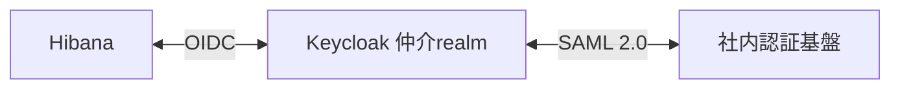

# 社内SAML認証基盤とKeycloakの接続

この文書は導入先が管理する外部認証基盤の接続例です。Hibana本体にSAML実装やKeycloak管理機能は含みません。

HibanaはKeycloakを仲介として、既存のSAML 2.0認証基盤を利用できます。HibanaとKeycloakはOIDC、Keycloakと社内認証基盤はSAMLで連携します。



この構成では、社内認証基盤が本人確認・MFAを担当し、Hibanaが所属テナントと操作権限を管理します。ブラウザも両方の認証基盤へ接続できる必要があります。Control PlaneからのOIDC通信先は仲介Keycloakです。

## 1. 仲介Keycloakを用意する

本番のKeycloakは永続DBとHTTPSを使って運用します。以下の例は、外部URLを`https://sso.example.com`、realmを`hibana`、社内IdPのaliasを`corporate-saml`としています。これらは導入先の値へ置き換えてください。

[OIDC設定手順](authentication.md#keycloakでの登録)に従って、仲介realmにHibana用のOIDCクライアントを登録します。Control Planeには、社内SAML IdPではなく、仲介realmのURLを設定します。

```dotenv
OIDC_ISSUER_URL=https://sso.example.com/realms/hibana
OIDC_CLIENT_ID=hibana
OIDC_CALLBACK_URL=https://hibana.example.com/api/auth/oidc/callback
OIDC_CONSOLE_URL=https://hibana.example.com/
OIDC_SESSION_TTL_SECS=900
```

`OIDC_CLIENT_SECRET`はHibana用クライアントの秘密値です。Control Plane用Secretへ保存します。`OIDC_ALLOW_INSECURE_HTTP`は本番では設定しません。

## 2. 社内IdPとの信頼関係を設定する

KeycloakのIdentity ProvidersからSAML v2.0を追加します。[設定テンプレート](../deploy/keycloak/saml-identity-provider.example.json)は、Keycloak Admin REST APIの`POST /admin/realms/hibana/identity-provider/instances`へ渡す形式です。管理画面でも同じ値を設定できます。

テンプレートの`CHANGE_ME`と`https://sso.example.com`を置き換え、社内IdPの管理者と次の情報を交換します。

| 設定 | この例の値・入手先 |
|---|---|
| SP Entity ID | `https://sso.example.com/realms/hibana/broker/corporate-saml`。両側で完全一致させる |
| ACS / Reply URL | `https://sso.example.com/realms/hibana/broker/corporate-saml/endpoint` |
| SPメタデータ | `https://sso.example.com/realms/hibana/broker/corporate-saml/endpoint/descriptor` |
| IdP Entity ID | 社内IdPが公開する識別子。`idpEntityId`へ設定 |
| IdP SSO URL | 社内IdPのHTTP-POST用ログインURL。`singleSignOnServiceUrl`へ設定 |
| IdP署名証明書 | 社内IdPのメタデータ等で確認した公開証明書。PEMのヘッダー・改行を除いたBase64を`signingCertificate`へ設定 |
| SP署名証明書 | 仲介KeycloakのSPメタデータから社内IdPへ登録 |
| 安定した社員識別子 | この例ではSAML属性`employee_id`。社内IdPで、一意・変更されない・別人に再利用しない値を発行 |

このテンプレートはHTTP-POSTを使い、AuthnRequestとAssertionの署名を要求し、IdPの署名と発行元を検証します。社内IdP側でもSPの署名を検証し、応答とAssertionに署名する設定にします。検証を無効にして接続エラーを回避しないでください。

社内基盤が安定したpersistent NameIDを提供する場合は、`principalType`を`SUBJECT`にしてNameIDを使う構成も可能です。このリポジトリの自動試験は`employee_id`属性を使っています。属性名やBindingを変更する場合は導入先のIdPとの試験が必要です。

本テンプレートは証明書を明示的に登録する方式です。証明書更新時にはKeycloak側の信頼する証明書も更新します。新旧の証明書を併用する移行期間を取り、社内IdPの切替前後にログインを検証してください。

## 3. ユーザーをHibanaへ紐付ける

識別子は次の3つを区別します。

| 識別子 | 用途 |
|---|---|
| 社内IdPの`employee_id` | 仲介Keycloakが社内の本人を識別する |
| 仲介KeycloakのユーザーID（OIDCの`sub`） | Hibanaに登録する`oidc_subject` |
| Hibanaの`user_id` | テナント内の権限・トークン・停止を管理する |

管理者が仲介realmのユーザーと外部IDのリンクを事前登録する例です。Admin REST APIの`POST /admin/realms/hibana/users`へ送信します。

```json
{
  "username": "corporate-employee-12345",
  "enabled": true,
  "email": "employee@example.com",
  "firstName": "Example",
  "lastName": "Employee",
  "federatedIdentities": [{
    "identityProvider": "corporate-saml",
    "userId": "社内IdPが発行するemployee_idの実際の値",
    "userName": "employee-12345"
  }]
}
```

仲介realmのユーザーにパスワードを発行する必要はありません。作成後にKeycloakのUsers画面またはAdmin REST APIでユーザーIDを確認し、Hibanaの最初の管理者には`admin_oidc_subject`、追加ユーザーには`oidc_subject`として登録します。既存ユーザーの移行は[OIDCの紐付けAPI](authentication.md#既存環境の移行)を使います。

社内IdPの社員識別子を、そのままHibanaの`oidc_subject`へ設定しないでください。Hibanaが受け取る`sub`は仲介Keycloakが発行したものです。メールアドレスの一致だけで既存の管理者へ自動リンクする設定は使いません。

事前登録以外にKeycloakの初回ログインでユーザーを作成する運用もできますが、Hibanaのテナント所属は別途管理者が登録します。Keycloakへのログイン成功だけではHibanaの利用権限は付与されません。

## 4. ログインする

コンソールでテナントを入力し、「組織のアカウントでログイン」を押した後、Keycloakの「社内アカウント」を選びます。社内IdPで認証するとコンソールへ戻ります。

```sh
hibana login --url https://hibana.example.com/api --tenant team
```

CLIも同じ認証経路を使い、ブラウザからCLIのループバック待受へ戻ります。社内IdPの起動ポータルからのIdP起点SSOは、この試験の対象外です。Hibanaからログインを開始してください。

Hibanaのログアウトは社内SSO全体を終了しません。社内側の停止だけで、発行済みのHibanaセッションやAPIトークンが即時失効するわけでもありません。即時停止はHibana側のユーザー停止APIも実行します。SAML Single Logout、OIDC Back-Channel Logout、SCIMによる停止同期はこの構成には追加していません。

## 自動検証

```sh
npm ci --prefix console --ignore-scripts
npx --prefix console playwright install chromium
HIBANA_TEST_SAML=1 bash scripts/test-oidc.sh
```

テストは使い捨てのPostgreSQL・Redis・Keycloak 26.7.4を起動します。ひとつのKeycloak内に、別の鍵・ユーザーを持つ社内SAML IdP役の`corporate` realmと、仲介役の`hibana` realmを用意します。両realm間は実際の署名付きSAML通信です。Hibana本体はOIDCのみを受け取り、OIDC専用の2台のControl Planeを使います。テスト用HTTPはループバックに限定し、既存の社内基盤やデータは利用しません。

検証項目は次の通りです。

- 署名付きAuthnRequest・Response・Assertionによるログイン、仲介`sub`とHibanaユーザーの紐付け
- 別Control Planeでの単回コード交換、コンソールのログイン・ログアウト、CLIのブラウザログイン
- SAML署名を更新せず本人の識別属性を改ざんした応答の拒否
- 同じメールアドレスの別ユーザー、別テナントへのアクセスの拒否
- 全ログアウト後のセッション・未交換コードの失効、停止後の再ログイン拒否

導入用テンプレートをテストでも読み込み、URLと公開証明書を使い捨て環境の値に差し替えています。検証コードは[saml-broker-fixture.mjs](../scripts/saml-broker-fixture.mjs)と[test-saml-broker.mjs](../scripts/test-saml-broker.mjs)です。画面の確認用画像は`.local/verification/oidc/saml-console.png`と`saml-signature-rejected.png`へ保存します。SAML Assertionやトークンは成果物へ保存しません。

検証済みのSAML IdPはKeycloakです。Entra ID・AD FSなど実際の導入先との接続、MFA、暗号化Assertion、証明書ローテーションは、導入先の設定で別途検証してください。

設定項目の詳細は[Keycloak 26.7.4公式ガイド](https://www.keycloak.org/docs/26.7.4/server_admin/#_identity_broker)を参照してください。
