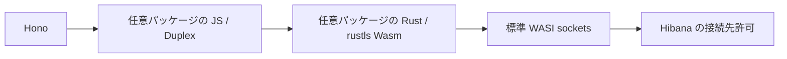

# Optional Node-style TCP/TLS clients

`@hibana/node-net` は、Hono アプリに任意で追加する TCP/TLS クライアントの限定実装です。Hibana 本体・標準 CLI・Worker イメージには含めません。Node.js 全体や、Node 向け DB ドライバーの無変更動作を保証するものではありません。

`pg` の利用には別の任意拡張 [@hibana/postgres](../postgres/README.md) を併用します。pg の認証・依存 API・ソケット設定の差異をその拡張で扱います。[DB・ORM の検証結果](../../docs/postgres-compatibility.md)を確認してください。

## アプリへの導入

配布者が作成した `hibana-node-net-0.1.0.tgz` を受け取って、アプリの依存に固定します。現在はこのリポジトリで配布物を作成できる状態で、npm レジストリや GitHub Releases への公開はしていません。

```sh
npm install --save-exact --ignore-scripts ./hibana-node-net-0.1.0.tgz
cargo install wac-cli --version 0.11.0 --locked --no-default-features --features wit
```

WAC は CLI が Wasm 部品を合成するためのツールです。利用者は Rust や C で互換部品を再ビルドする必要はありません。`hibana.json` に必要な拡張を明示します。

```json
{
  "name": "my-api",
  "main": "src/index.ts",
  "extensions": ["@hibana/node-net"]
}
```

```ts
import { Hono } from 'hono';
import tls from 'node:tls';

const app = new Hono<{ Bindings: { ECHO_HOST: string } }>();
app.get('/', async c => {
  const result = await new Promise<string>((resolve, reject) => {
    // env.ECHO_HOST is the DNS name of an administrator-approved TLS echo server.
    const socket = tls.connect({ host: c.env.ECHO_HOST, port: 443 });
    let reply = '';
    socket.setEncoding('utf8');
    socket.on('data', chunk => { reply += chunk; });
    socket.on('error', reject);
    socket.once('secureConnect', () => socket.end('hello\n'));
    socket.once('close', () => resolve(reply));
    socket.setTimeout(5000, () => socket.destroy(new Error('Connection timed out')));
  });
  return c.text(result);
});
export default app;
```

通常の `hibana build` / `hibana deploy` で、JS と Rust 部品をまとめた一つの Wasm を配備します。`net` / `node:net`、`tls` / `node:tls`、`stream` / `node:stream`、`node:buffer` の import をこのパッケージへ結び付けます。Buffer とストリーム用のブラウザー process shim も同梱します。型定義の完全互換は提供していません。

## 対応範囲

| 機能 | 対応 |
|---|---|
| TCP | 外向きの `connect` / `createConnection` / `new Socket().connect()`、IPv4/IPv6、ホスト名解決 |
| ストリーム | `readable-stream` の Duplex、`write` / `end` / `destroy` / `pipe`、UTF-8、backpressure、half-close |
| イベント | `connect`、`data`、`end`、`finish`、`drain`、`error`、`close`、`timeout`、`secureConnect` |
| TLS | rustls による TLS 1.2/1.3、公開 CA または PEM の `ca`、ホスト名検証、`servername`、文字列配列の ALPN |
| STARTTLS | `tls.connect({ socket, servername, ca })`。接続済みで、読み書きのバッファが空の TCP ソケットから所有権を移す |
| 制御 | `setTimeout`、`setKeepAlive`、送受信バイト数。タイムアウトイベントだけでは自動切断しない |

TCP listen/server、Unix socket、UDP、独自 lookup、ローカルアドレス指定、クライアント証明書、証明書情報取得、セッションの再利用、TLS 再交渉、`ref` / `unref` は対象外です。WASI 0.2 に TCP_NODELAY がないため `setNoDelay` も未対応としてエラーにします。このメソッドを必須とする既存ライブラリには別途移植が必要です。

未知の接続オプションや `rejectUnauthorized: false`、独自の `checkServerIdentity` は拒否します。指定 CA が空・不正でも既定 CA に戻しません。TLS エラーのコードは `ERR_TLS_CONNECTION` にまとめ、詳細をメッセージに保持します。Node.js と全てのエラーコード・イベント順序が一致する保証はありません。

## 実装と制限



JS と Rust の境界はパッケージの `wit/world.wit` に固定します。通信処理、TLS、CA bundle はアプリ側に入り、ホストの Node 用 API や TLS プラグインは追加しません。rustls の暗号処理には ring を使います。暗号アルゴリズム自体を独自実装しません。

現在の [ComponentizeJS](https://github.com/bytecodealliance/ComponentizeJS#async-support) では imported function が同期呼び出しです。そのため Rust はソケットの準備状況を非ブロッキングで確認し、JS の共有タイマーが 1〜8 ms 間隔で処理を進めます。単一接続の待機が他の接続や JS タイマーを止めませんが、ネイティブの readiness 通知と比べると待機中の CPU 使用と通信遅延が増えます。高スループット向けの性能検証は未実施です。

同時接続はインスタンス当たり 32 本、1 回の読み書きは最大 16 KiB、TLS 送信バッファは接続当たり 128 KiB に制限します。読み取りは Duplex の backpressure に従います。複数の DNS アドレスは順に試し、Happy Eyeballs は実装していません。接続が返らないケースに備えてアプリでタイムアウトと `destroy()` を設定してください。Hibana のリクエスト終了後に接続を持ち越すプールは提供しません。

## 通信権限

`permissions: ["outbound-network"]` は必要権限の宣言で、接続許可を付与しません。配備先の管理者が、既存の `PUT /components/{id}/versions/{version}/capabilities/egress` API の `allow_outbound` に `host:port` を設定します。この API は既存の許可一覧を全置換します。

Hibana の既存ポリシーでは loopback・プライベートアドレス等への通信は許可一覧にあっても拒否します。現在の `hibana dev` も外向き通信を拒否するため、この拡張を宣言したアプリは dev の事前検査で停止します。パッケージの導入でこの制限は変わりません。

## 配布者向けビルドと検証

リポジトリの Rust toolchain と `wasm32-wasip2` ターゲット、Node 24 以降、Wasm 対応 clang が必要です。macOS の Apple clang は Wasm に対応していないため、公式 [WASI SDK](https://github.com/WebAssembly/wasi-sdk/releases) 34 を使用できます。

```sh
cd extensions/node-net
npm ci --ignore-scripts
WASI_SDK_PATH=/absolute/path/to/wasi-sdk-34 npm pack
```

`npm pack` は `prepack` で Rust 部品をビルドします。配布物にはコンパイル済み Wasm・WIT・JS・README・LICENSE と依存のライセンス通知が入り、Rust のソース、C コンパイラー、作者用ビルドスクリプトは入りません。依存は npm と Cargo の lockfile で維持します。公開 CA の更新や rustls/ring の修正は、このパッケージを更新・再配布して反映します。

受入試験はリポジトリのルートで実行します。SDK 依存、WAC、ビルド済みの拡張・Control Plane・Worker、Wasmtime CLI 36.0.14、OpenSSL が必要です。

```sh
WASMTIME_BIN=/absolute/path/to/wasmtime \
HIBANA_TEST_CP_BIN=target/debug/hibana-control-plane \
HIBANA_TEST_RUNTIME_BIN=target/release/hibana-worker \
node scripts/test-node-net-extension.mjs
```

試験専用の Hono コンポーネントを汎用 Wasmtime 上で実行し、ローカル TCP/TLS fixture と通信させます。この試験だけが `inherit-network` を明示的に有効にします。実際の Hibana Worker では同じコンポーネントの通信が拒否されることも検証します。基盤の DB や稼働クラスタは使用しません。
