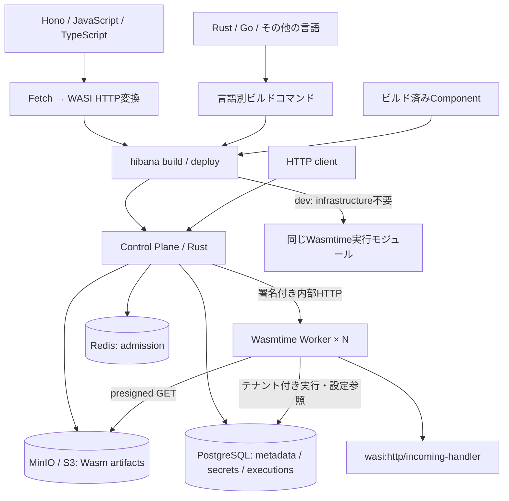

# Hibanaの構成

`workerd`とCloudflare互換Bindingは使用しません。実行モジュールは`crates/worker/src/runtime/`、単独開発サーバーは`dev.rs`、HTTP受付は`direct_http.rs`、分散実行の統括は`service.rs`です。`main.rs`は起動と停止の組立てだけを担当します。Control Planeも起動・ルーティング・領域別ハンドラー・DBアクセスを分けています。各モジュールの責務と依存方向は[アーキテクチャ](docs/architecture.md)を参照してください。

KubernetesはPod配置・更新・再起動を担当し、HibanaはComponentの配備、テナント分離、実行を担当します。アプリごとにPodを作る実装ではなく、Worker群が呼び出しごとのWasmtime Storeを作成します。
