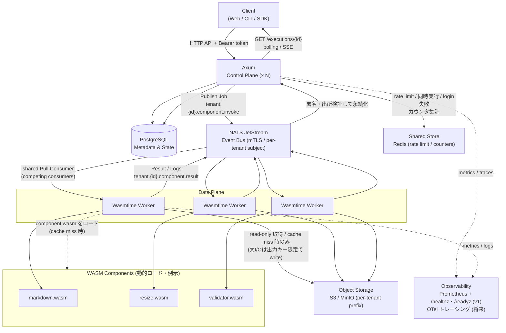

# 全体アーキテクチャ図（論理構成）

Control Plane / Data Plane の論理的な役割と、結果返却を含むデータフローを示す。Worker と Component は固定割り当てではなく、Worker が任意の Component を動的ロードする（例示）。正典は `仕様書.md` 本文とする。

```mermaid
flowchart TB

    Client["Client<br/>(Web / CLI / SDK)"]

    Axum["Axum<br/>Control Plane (x N)"]

    Postgres[("PostgreSQL<br/>Metadata & State")]

    NATS["NATS JetStream<br/>Event Bus (mTLS / per-tenant subject)"]

    Storage["Object Storage<br/>S3 / MinIO (per-tenant prefix)"]

    Shared["Shared Store<br/>Redis (rate limit / counters)"]

    Obs["Observability<br/>Prometheus + /healthz・/readyz (v1)<br/>OTel トレーシング (将来)"]

    subgraph DataPlane["Data Plane"]
        Worker1["Wasmtime Worker"]
        Worker2["Wasmtime Worker"]
        Worker3["Wasmtime Worker"]
    end

    subgraph Components["WASM Components (動的ロード・例示)"]
        CompA["markdown.wasm"]
        CompB["resize.wasm"]
        CompC["validator.wasm"]
    end

    Client -->|HTTP API + Bearer token| Axum

    Axum --> Postgres
    Axum -->|"rate limit / 同時実行 / login失敗<br/>カウンタ集計"| Shared
    Axum -.->|"metrics / traces"| Obs
    Axum -->|"Publish Job<br/>tenant.{id}.component.invoke"| NATS

    NATS -->|"shared Pull Consumer<br/>(competing consumers)"| Worker1
    NATS --> Worker2
    NATS --> Worker3

    Worker1 -->|"read-only 取得 / cache miss 時のみ<br/>(大I/Oは出力キー限定で write)"| Storage
    Worker2 --> Storage
    Worker3 --> Storage

    Worker1 -.->|"component.wasm をロード<br/>(cache miss 時)"| Components

    Worker1 --> CompA
    Worker2 --> CompB
    Worker3 --> CompC

    Worker1 -->|"Result / Logs<br/>tenant.{id}.component.result"| NATS
    Worker2 --> NATS
    Worker3 --> NATS

    Worker1 -.->|"metrics / logs"| Obs

    NATS -->|"署名・出所検証して永続化"| Axum

    Axum --> Postgres

    Axum -->|"GET /executions/{id}<br/>polling / SSE"| Client
```
